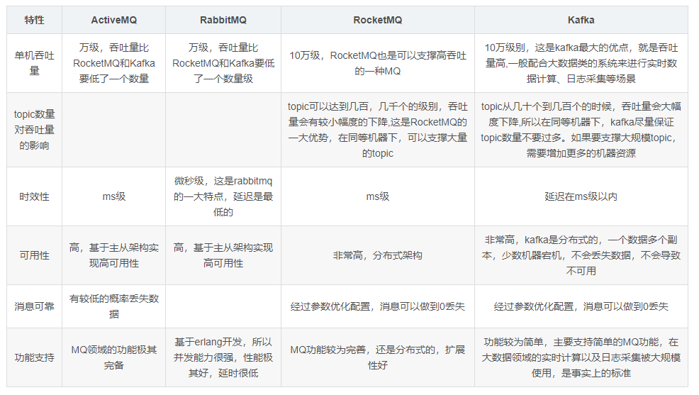

## MQ & 主流MQ对比

<b>参考文档：</b>
> https://cloud.tencent.com/developer/article/1483258 (MQ详解及四大MQ比较)

### 一、MQ简介

> MQ（Message Queue）消息队列，是基础数据结构中“先进先出”的一种数据结构。指把要传输的数据（消息）放在队列中，用队列机制来实现消息传递——生产者产生消息并把消息放入队列，然后由消费者去处理。消费者可以到指定队列拉取消息，或者订阅相应的队列，由MQ服务端给其推送消息。

### 二、MQ特点

<b>1.2.1 先进先出</b>
> 不能先进先出，都不能说是队列了。消息队列的顺序在入队的时候就基本已经确定了，一般是不需人工干预的。而且，最重要的是，数据是只有一条数据在使用中。 这也是MQ在诸多场景被使用的原因。

<b>1.2.2 发布订阅</b>
> 发布订阅是一种很高效的处理方式，如果不发生阻塞，基本可以当做是同步操作。这种处理方式能非常有效的提升服务器利用率，这样的应用场景非常广泛。

<b>1.2.3 持久化</b>
> 持久化确保MQ的使用不只是一个部分场景的辅助工具，而是让MQ能像数据库一样存储核心的数据。

<b>1.2.4 分布式</b>
> 在现在大流量、大数据的使用场景下，只支持单体应用的服务器软件基本是无法使用的，支持分布式的部署，才能被广泛使用。而且，MQ的定位就是一个高性能的中间件

### 三、MQ 应用场景

<b> 2.1 异步处理 </b>

<b>  2.2 应用解耦 </b>

<b>  2.3 流量削峰 </b>

<b>  2.4 广播 </b>

<b>  2.5 .... 其它 </b>


### 四、主流MQ对比

#### 1. RocketMQ
```
阿里系下开源的一款分布式、队列模型的消息中间件，原名Metaq，3.0版本名称改为RocketMQ，是阿里参照kafka设计思想使用java实现的一套mq。同时将阿里系内部多款mq产品（Notify、metaq）进行整合，只维护核心功能，去除了所有其他运行时依赖，保证核心功能最简化，在此基础上配合阿里上述其他开源产品实现不同场景下mq的架构，目前主要多用于订单交易系统。
具有以下特点：

能够保证严格的消息顺序
提供针对消息的过滤功能
提供丰富的消息拉取模式
高效的订阅者水平扩展能力
实时的消息订阅机制
亿级消息堆积能力
```

#### 2 RabbitMQ
```
使用Erlang编写的一个开源的消息队列，本身支持很多的协议：AMQP，XMPP, SMTP,STOMP，也正是如此，使的它变的非常重量级，更适合于企业级的开发。
同时实现了Broker架构，核心思想是生产者不会将消息直接发送给队列，消息在发送给客户端时先在中心队列排队。对路由(Routing)，负载均衡(Load balance)、数据持久化都有很好的支持。多用于进行企业级的ESB整合。
```

#### 3. ActiveMQ
```
Apache下的一个子项目。使用Java完全支持JMS1.1和J2EE 1.4规范的 JMS Provider实现，少量代码就可以高效地实现高级应用场景。
可插拔的传输协议支持，比如：in-VM, TCP, SSL, NIO, UDP, multicast, JGroups and JXTA transports。
RabbitMQ、ZeroMQ、ActiveMQ均支持常用的多种语言客户端 C++、Java、.Net,、Python、 Php、 Ruby等。
```

#### 4. Redis
```
使用C语言开发的一个Key-Value的NoSQL数据库，开发维护很活跃，虽然它是一个Key-Value数据库存储系统，但它本身支持MQ功能，所以完全可以当做一个轻量级的队列服务来使用。
对于RabbitMQ和Redis的入队和出队操作，各执行100万次，每10万次记录一次执行时间。测试数据分为128Bytes、512Bytes、1K和10K四个不同大小的数据。
实验表明：入队时，当数据比较小时Redis的性能要高于RabbitMQ，而如果数据大小超过了10K，Redis则慢的无法忍受；出队时，无论数据大小，Redis都表现出非常好的性能，而RabbitMQ的出队性能则远低于Redis。
```

#### 5. Kafka
```
Apache下的一个子项目，使用scala实现的一个高性能分布式Publish/Subscribe消息队列系统，具有以下特性：

快速持久化：通过磁盘顺序读写与零拷贝机制，可以在O(1)的系统开销下进行消息持久化；
高吞吐：在一台普通的服务器上既可以达到10W/s的吞吐速率；
高堆积：支持topic下消费者较长时间离线，消息堆积量大；
完全的分布式系统：Broker、Producer、Consumer都原生自动支持分布式，依赖zookeeper自动实现复杂均衡；
支持Hadoop数据并行加载：对于像Hadoop的一样的日志数据和离线分析系统，但又要求实时处理的限制，这是一个可行的解决方案。
```

#### 6. ZeroMQ
```
号称最快的消息队列系统，专门为高吞吐量/低延迟的场景开发，在金融界的应用中经常使用，偏重于实时数据通信场景。
ZMQ能够实现RabbitMQ不擅长的高级/复杂的队列，但是开发人员需要自己组合多种技术框架，开发成本高。因此ZeroMQ具有一个独特的非中间件的模式，更像一个socket library，你不需要安装和运行一个消息服务器或中间件，因为你的应用程序本身就是使用ZeroMQ API完成逻辑服务的角色。
但是ZeroMQ仅提供非持久性的队列，如果down机，数据将会丢失。如：Twitter的Storm中使用ZeroMQ作为数据流的传输。

ZeroMQ套接字是与传输层无关的：ZeroMQ套接字对所有传输层协议定义了统一的API接口。
默认支持 进程内(inproc) ，进程间(IPC) ，多播，TCP协议，在不同的协议之间切换只要简单的改变连接字符串的前缀。可以在任何时候以最小的代价从进程间的本地通信切换到分布式下的TCP通信。
ZeroMQ在背后处理连接建立，断开和重连逻辑。

特性：
无锁的队列模型：对于跨线程间的交互（用户端和session）之间的数据交换通道pipe，采用无锁的队列算法CAS；在pipe的两端注册有异步事件，在读或者写消息到pipe的时，会自动触发读写事件。
批量处理的算法：对于批量的消息，进行了适应性的优化，可以批量的接收和发送消息。
多核下的线程绑定，无须CPU切换：区别于传统的多线程并发模式，信号量或者临界区，zeroMQ充分利用多核的优势，每个核绑定运行一个工作者线程，避免多线程之间的CPU切换开销。
```

#####四种MQ对比图




 


