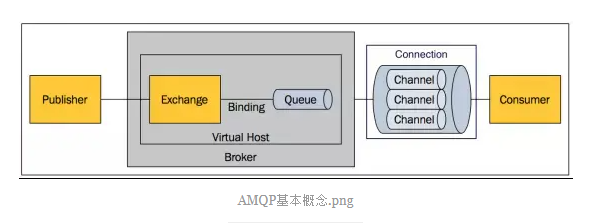

## RabbitMQ
1. 基于AMQP协议
2. 底层使用ErLang语言编写
3. 与SpringAMQP完美的整合， API丰富
4. 集群模式丰富， 表达式配置， HA模式， 镜像队列模型
5. 保证数据不丢失的前提，做到高可靠性， 可用性

### AMQP (Advanced Message Queue Protocol) 高级消息队列协议 

<b> Broker/Server(消息代理服务器):</b> 

<b> vhost(虚拟主机):</b>

> 本质上就是一个mini版的代理服务器（拥有自己的队列、交换器和绑定，用于进行逻辑隔离，是最上层的消息路由。
>
> 拥有自己的权限机制，RabbitMQ默认的vhost：“/”, 每个用户只能访问自己的vhost（通常会被指派至少一个vhost），进而用户只能访问自己的队列、交换器和绑定。
>
> 一个vhost里面可以有若干个Exchange和Queue，但不能存在相同名称的Exchange或相同名称的Queue.

<b> Exchange(交换器):</b>

> 接收消息，再根据匹配规则，分发消息到队列（queue）中去。

<b> Queue(消息队列):</b> 

> 保存消息并将他们转发给消费者

<b> Binding Key(绑定规则):</b>

> Exchange 和 Queue 之间的绑定规则

<b> Message(消息):</b>

> 由 Properties 和 Body 组成， Properties可对消息进行修饰，比如消息的优先级，延迟等高级特性； Body就是消息体中的内容；

<b> Routing key(路由规则):</b>

> 路由规则， 交换器可以用它来确定如何路由一个特定的消息

<b> Producer(生产者):</b>

> 消息来源

<b> Consumer(消费者):</b>

> 消费消息

<b> Connection(连接):</b>

> 客户端与代理服务器建立的TCP连接

<b> Channel(信道):</b>

> 客户端和代理服务器之间TCP连接内的虚拟连接，解决TCP连接数量限制及降低TCP连接代价。每个信道有一个ID，其概念与“多路复用”类似。

 

