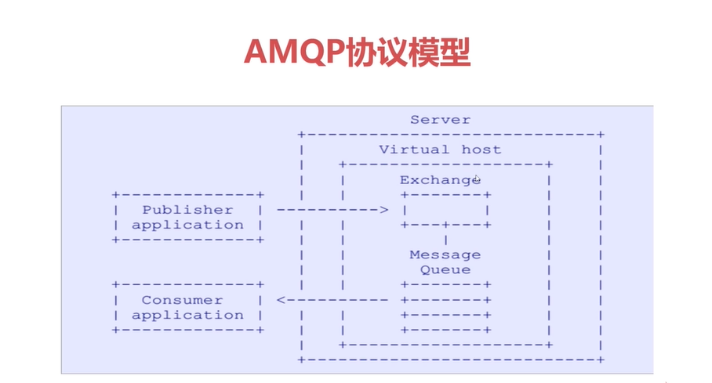
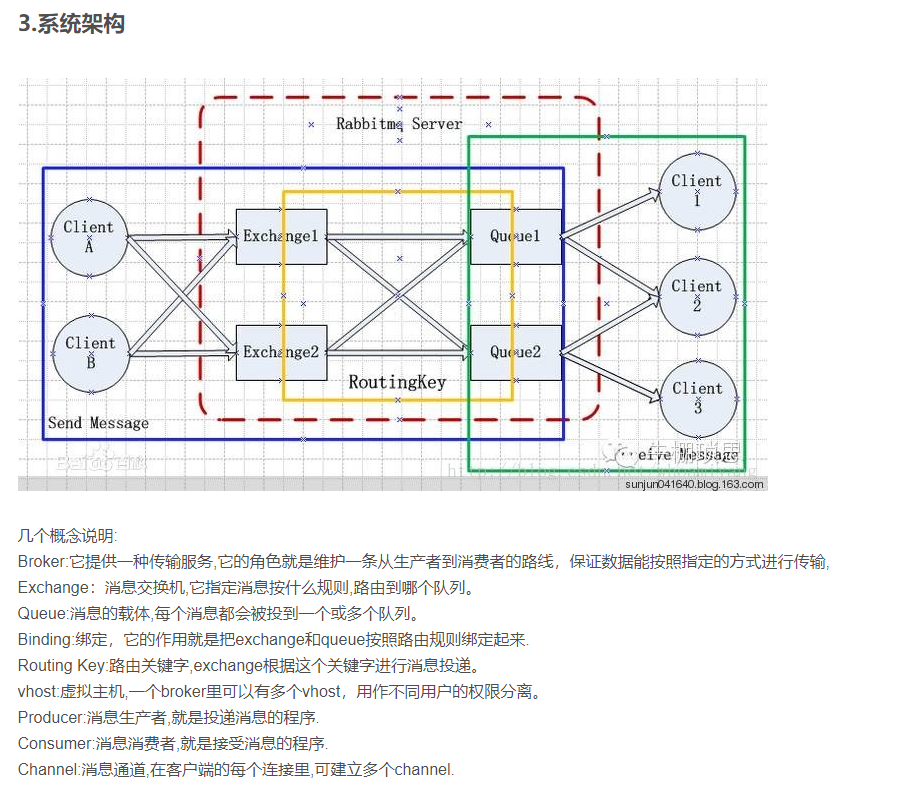

## RabbitMQ
1. 基于AMQP协议
2. 底层使用ErLang语言编写
3. 与SpringAMQP完美的整合， API丰富
4. 集群模式丰富， 表达式配置， HA模式， 镜像队列模型
5. 保证数据不丢失的前提，做到高可靠性， 可用性

### AMQP (Advanced Message Queue Protocol) 高级消息队列协议 

### 安装

### 概念
Message: 由 Properties 和 Body 组成， Properties可对消息进行修饰，比如消息的优先级，延迟等高级特性； Body就是消息体中的内容；

Virtual Host: 虚拟地址，用于进行逻辑隔离，是最上层的消息路由。一个Virtual Host里面可以有若干个Exchange和Queue，但不能存在相同名称的Exchange或相同名称的Queue.

Exchange: 交换机，接受消息，根据路由键转发消息道绑定的队列

Binding: Exchange 和 Queue之间的虚拟连接， binding中可以包含routing key

Routing key:路由规则， 虚拟机可以用它来确定如何路由一个特定的消息

Queue: 消息队列， 保存消息并将他们转发给消费者

### 消息流转

### 待学习内容
1. 支持的最大单条消息限制；

2. 未消费的队列最大长度限制； 拒绝策略；

