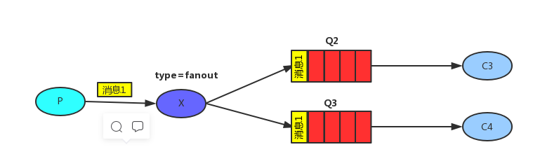
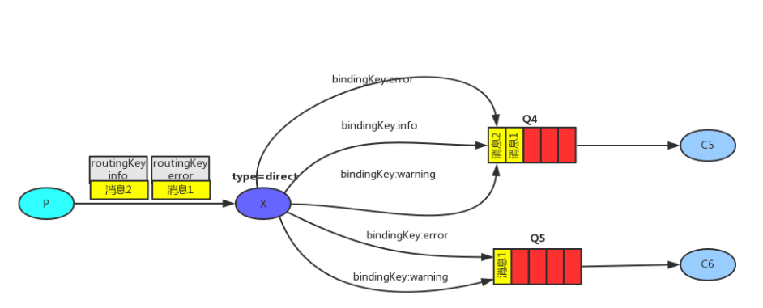
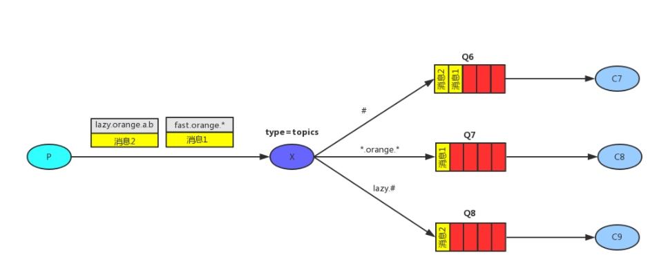
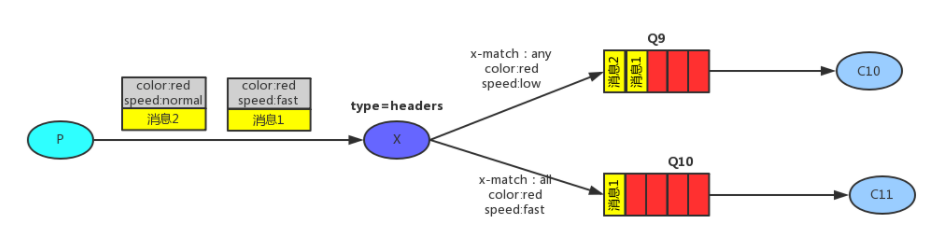

## 交换机 (Exchange)

### 一、属性


### 二、类型

<b> 1. fanout </b>:

> 规则: 消息会被广播给所有与之绑定的队列， 即 binging_key 和 routing_key 是无效的。




<b> 2. direct </b>:

> 规则： 消息会被推送至 binding_key和 routing_key 完全匹配的队列中。 




<b> 3. topic </b>:

> 规则： binding_key 和 routing_key 通过匹配规则来匹配
> 
> 匹配规则(*): * 表示单个位置的匹配， 比如 binging_key 是 *.message.* , 那routing_key是vm.message.create可以匹配成功； 但routing_key是 vm.message.inner.create 则匹配失败；
> 
> 匹配规则(#): # 表示多个位置的匹配， 比如 binging_key 是 vm.message.# , 那 routing_key是 vm.message.create 或 vm.message.inner.create 都能匹配成功；




<b> 4. headers </b>:

> 规则: headers类型的交换机分发消息不依赖routingKey, 是使用消息的headers里属性值来匹配的(详见消息属性文章)。
> 
> 匹配模式有两种，在队列绑定到交换机时用x-match来指定，all代表定义的多个键值对都要满足，而any则代码只要满足一个就可以了。




### 三、参数详解
```
Tips: 该参数为原生代码中声明交换机的参数， 如果使用Spring-amqp, 参数则有点小区别

方法来源：com.rabbitmq.client.channel

DeclareOk exchangeDeclare(String var1, BuiltinExchangeType var2, boolean var3, boolean var4, boolean var5, Map<String, Object> var6) throws IOException;
```
<b>1. exchange</b>：
> 名称

<b>2. type</b>：
> 类型

<b>3. durable</b>：
> 是否持久化，RabbitMQ(关闭|重启)后，没有持久化的Exchange将被清除

<b>4. autoDelete</b>：
> 是否自动删除，RabbitMQ(关闭|重启)后， 如果没有与之绑定的Queue，直接删除

<b>5. internal</b>：
> 是否内置的，如果为true，只能通过Exchange到Exchange

<b>6. arguments</b>：
> 结构化参数
