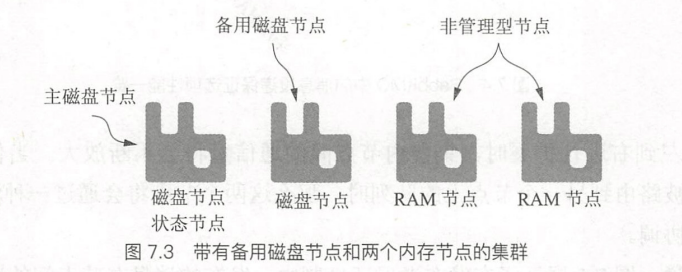
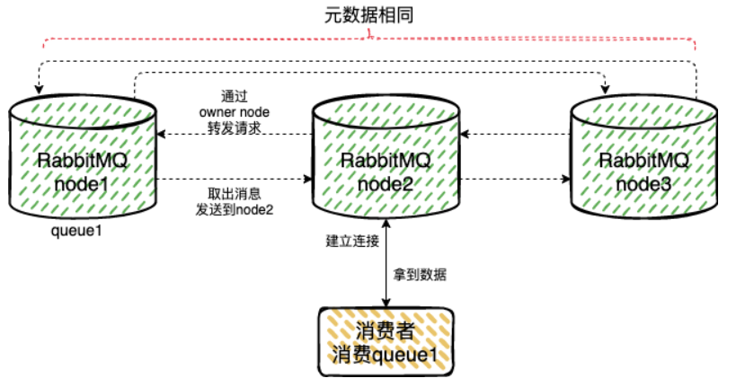
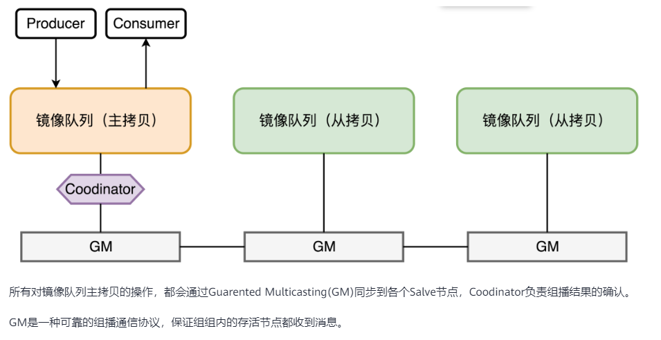
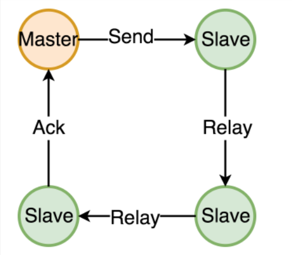

# RabbitMQ 节点 & 集群

### 参考文档
> 深入理解RabbitMQ 
> 
> https://cloud.tencent.com/developer/article/1391426 (rabbitmq 原理、集群、基本运维操作、常见故障处理)

## 一、节点

### 1.1 节点类型

#### 1.1.1 磁盘节点
> 磁盘节点将集群的元数据会同时存储在内存和磁盘上，(注：运行时状态包括交换机、队列、绑定、虚拟主机、用户和策略等信息的定义）
> 
> 因此，如果集群拥有大量的元数据时，相比内存节点，磁盘节点更容易受到磁盘I/O问题的困扰。

#### 1.1.2 内存节点:
> 内存节点仅将运行时状态信息存储在内存数据库中。

#### 1.1.3 状态节点:
> 如果使用 rabbitmq 管理插件的话，那么可以使用另一种节点类型， 即统计节点 Stats node。 
> 
> 它只能和磁盘节点搭配使用。统计节点负责收集集群中每个节点的全部统计数据和状态数据。
> 
> 在任何时刻，集群只能有一个统计节点。
> 
>对于大型集群设置来说，最佳策略是配置专门的管理节点，主磁盘节点和统计节点，并再至少配置一个磁盘节点以提供故转移的能力



```
Tips: 在拥有两个磁盘节点的集群拓扑设置中， 如果主节点发生故障的话，统计节点将会被
指派给磁盘节点。当主磁盘节点恢复并重新加入集群后，它并不会重新获得统计节点，
除非被指派为统计节点的备用节点停止运行或者离开集群。
```

### 1.2节点类型和消息持久化
> 不论是哪种节点类型都不会影响消息持久化的行为。当通过消息属性 delivery
mode 一条消息标记为持久化时，这条消息会被写入磁盘，而无关乎节点类型。因此，考虑
磁盘 1/0 RabbitMQ 集群节点的影响就显得很尤为重要

### 1.3节点类型与崩溃行为

> 当节点或者集群崩溃时，在磁盘节点启动并重新加入集群时，会被用来重建集群的运
行时状态。而对于内存节点来说，当加入集群时则不会包含任何运行时状态数据。在重新加
入集群时，集群中的其他节点会将诸如队列定义等信息发送给它。

```
Tips:

当创建集群时，确保至少存在一个磁盘型节点。当集群中拥有多个磁盘节点时，就能在发生硬件故障时更加游刃有余.
 
但多个磁盘节点在某些故障场景下是一把双刃剑。当集群中有多个节点故障时，如果其中两个磁盘节点对集群的共享状态不一致，那么你在尝试将集群恢复至先前状态时就会遇到困难。

假设这事儿真的发生了，那么建议将整个集群关闭并按顺序重启节点。启动那个持有最多正确状态数据的磁盘节点，然后再添加其他节点。
```

## 二、集群

### 2.1 集群部署方式

#### 2.1.1 单机模式
```
不必细说，省略....
```

#### 2.1.2 普通集群模式

```
RabbitMQ集群会始终同步四种类型的内部元数据：
a. 队列元数据：队列名称和它的属性
b. 交换器元数据：交换器名称、类型和属性
c. 绑定元数据：一张简单的表格展示了如何将消息路由到队列
d. vhost元数据：为vhost内的队列、交换器和绑定提供命名空间和安全属性
因此，当用户访问其中任何一个RabbitMQ节点时，通过rabbitmqctl查询到的queue／user／exchange/vhost等信息都是相同的
```

```
此模式下， RabbitMQ集群不会自动同步的数据：
a. 队列里的数据信息

也就是说，如果某个节点挂了， 那这个节点里的队列数据也将无法使用
```



以上图为例，集群上有三个节点，每个节点都存有交换机，队列，绑定关系等元数据。 但队列里的内容，只在node1上存在。那么：

##### 1） 生产者和消费者直接连接节点1的场景：

> 那此时 生产&消费 操作，基本上就只节点1有关了，和节点2和节点3没啥作用。 

##### 2） 生产者或消费者连接的是节点2或者节点3的场景：

> 比如生产者连接的是节点1，消费者连接的是节点2。 当消息进入节点1的队列后，消费者从节点2拉取时，RabbitMQ会临时在节点1、节点2间进行消息传输，把1中的消息实体取出并经过2发送给消费者

```
该模式存在一个问题就是当节点1故障后，2节点无法取到1节点中还未消费的消息实体。
如果做了队列持久化或消息持久化，那么得等节点1恢复，然后才可被消费，并且在节点1恢复之前其它节点不能再创建节点1已经创建过的持久队列；如果没有持久化的话，消息就会失丢。

这种模式更适合非持久化队列，只有该队列是非持久的，客户端才能重新连接到集群里的其他节点，并重新创建队列。假如该队列是持久化的，那么唯一办法是将故障节点恢复起来。
```

#### 2.1.3 镜像模式

> 镜像队列会在节点中同步队列的数据，最终的队列数据会存在于每个节点中(以实际配置的策略为准)，而不像普通模式中只会存在于创建它的节点中。
>
> 优点很明显，当有主机宕机的时候，因为队列数据会同步到所有节点上，避免了普通模式中的单点故障。
>
> 缺点就是性能不好，集群内部的同步通讯会占用大量的网络带宽，适合一些可靠性要求比较高的场景。

> Tips: 注意这里的镜像模式是针对队列而不是针对集群的， 每个设置了镜像模式的队列，都会有一个主节点和若干个从节点。 而不是整个MQ集群有一个节点是主节点，其它节点是从节点。
> 比如MQ集群有三个节点(node1, node2, node3), 上面建了两个镜像队列queue1, queue2，镜像模式为all .  可能针对queue1来说，主节点是node1, 从节点是node2 和 node3. 
> 而针对queue2, 其主节点是node2, 从节点是node1和 node3.

##### 镜像队列结构图：


```
针对镜像模式 RabbitMQ 也提供了几种模式，有效值为 all，exactly，nodes 默认为 all。

all 表示集群中所有的节点进行镜像；

exactly 表示指定个数的节点上进行镜像，节点个数由ha-params指定;

nodes 表示在指定的节点上进行镜像，节点名称由ha-params指定;

所以针对普通队列和镜像队列，我们可以选择其中几个队列作为镜像队列，在性能和可靠性之间找到一个平衡
```

关于镜像模式中消息的复制，这里也用的很巧妙，值得借鉴



1、master 节点向 slave 节点同步消息是通过组播 GM(Guaranteed Multicast) 来同步的。

2、所有的消息经过 master 节点，master 对消息进行处理，同时也会通过 GM 广播给所有的 slave，slave收到消息之后在进行数据的同步操作。

3、GM 实现的是一种可靠的组播通信协议，该协议能保证组播消息的原子性。具体如何实现呢？

它的实现大致为:将所有的节点形成一个循环链表，每个节点都会监控位于自己左右两边的节点，当有节点新增时，相邻的节点保证当前广播的消息会复制到新的节点上 当有节点失效时，相邻的节点会接管以保证本次广播的消息会复制到所有的节点。

因为是一个循环链表，所以 master 发出去的消息最后也会返回到 master 中，master 如果收到了自己发出的操作命令，这时候就可以确定命令已经同步到了所有的节点。