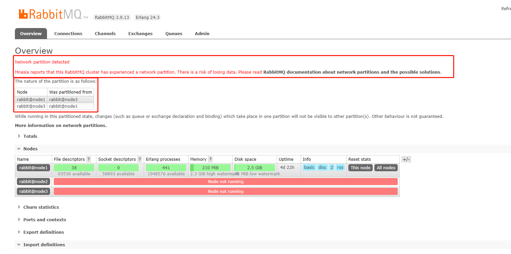
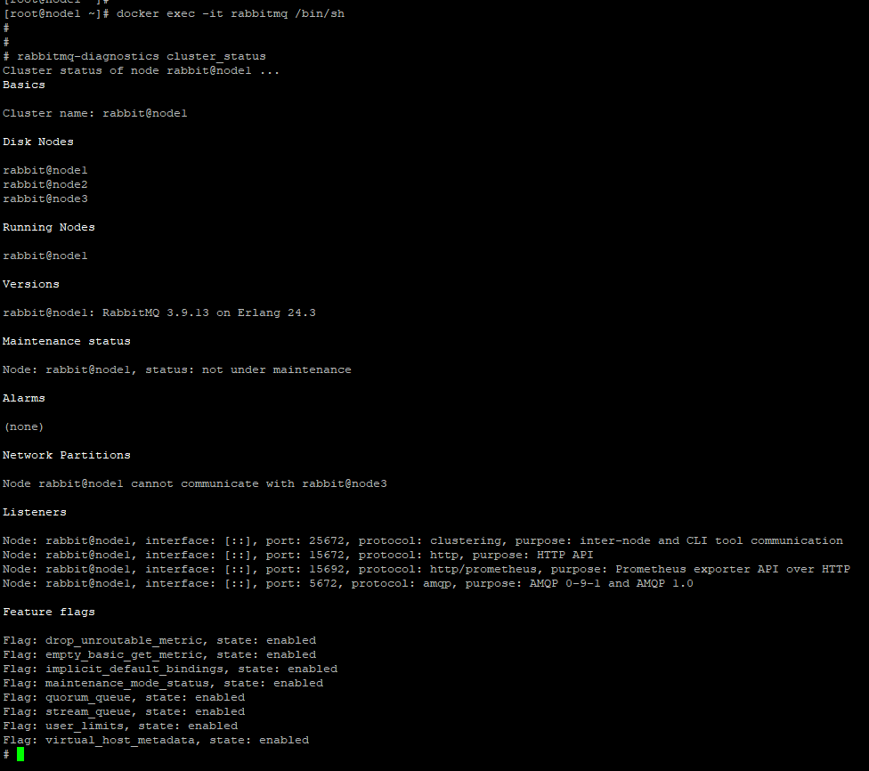
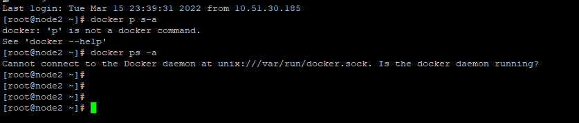
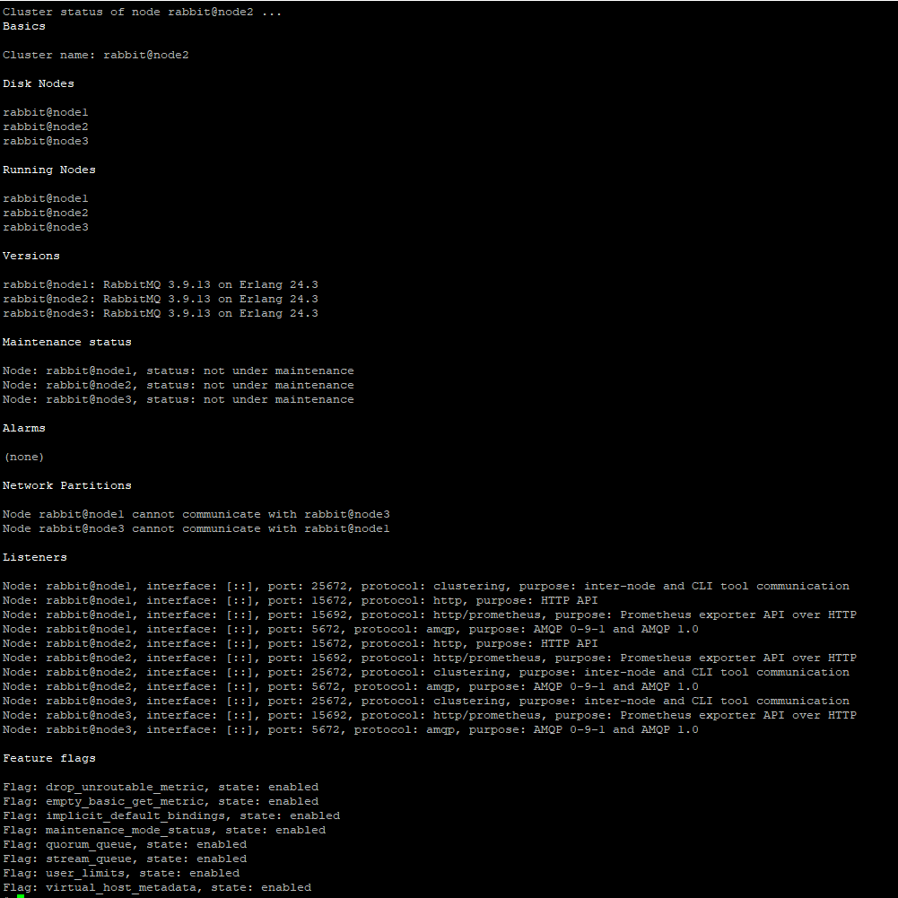
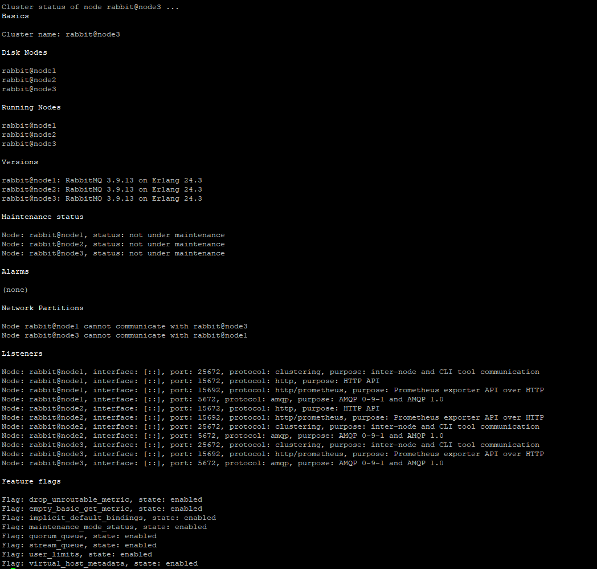

## 网络分区(脑裂)

### 背景：

> 早上，因为断电的原因。 RabbitMQ集群所在的三个物理节点都跪了。。 等恢复供电后打开RabbitMQ管理界面，就出现了下面的模样。

### 恢复步骤：

1. 先到三个节点上，各看看当前节点情况。 (使用命令:rabbitmq-diagnostics cluster_status)

> node1 当前状态：
>
> 

> node2 当前状态：
> 
>  

> node3 当前状态
> 
> 

状态统计：

| node1 | node2  | node3 |
|-------|--------|-------|
| 显示和node3产生网络分区 |  docker服务未启动 | 显示和node1产生网络分区 |

2. 先启动node2节点的docker服务

启动后 ，管理界面显示如下

> node1 当前状态
> 
> 

> node2 当前状态
> 
> 

> node3 当前状态
> 
> 

状态统计：

| node1 | node2  | node3 |
|-------|--------|-------|
| 显示和node3产生网络分区 |  正常 | 显示和node1产生网络分区 |

3. 有两种方式处理网络分区

3.1  先选择一个信任的分区(发生在其他分区的改变将不被记录到Mnesia中而直接丢弃)。 然后重启其它分区里的节点。 其它节点重启完后，之后重新将这些节点加入到当前信任的分区之中。
然后再重启这个受信任分区里的节点， 来去除告警。

3.2 先关闭所有的节点，选择一个信任的分区，然后再优先启动这个受信任分区里的节点， 之后再启动其它节点。

