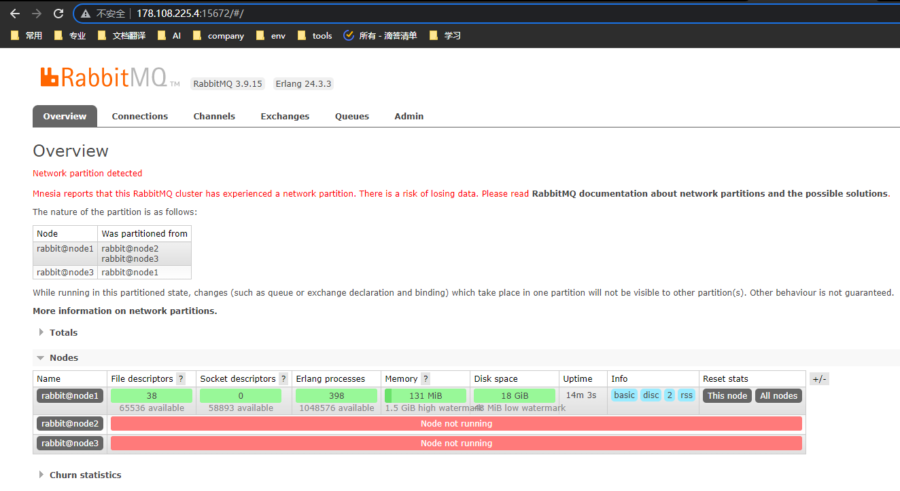
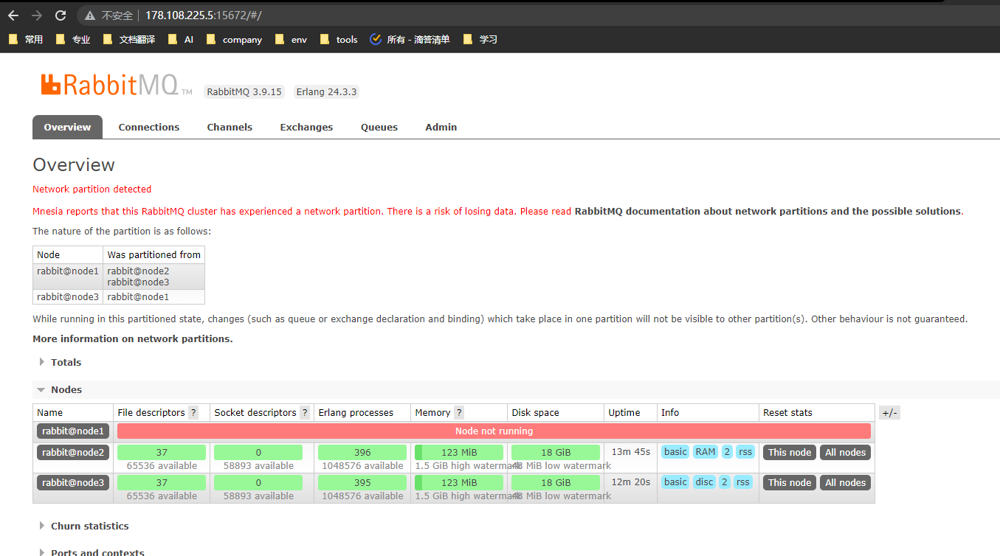
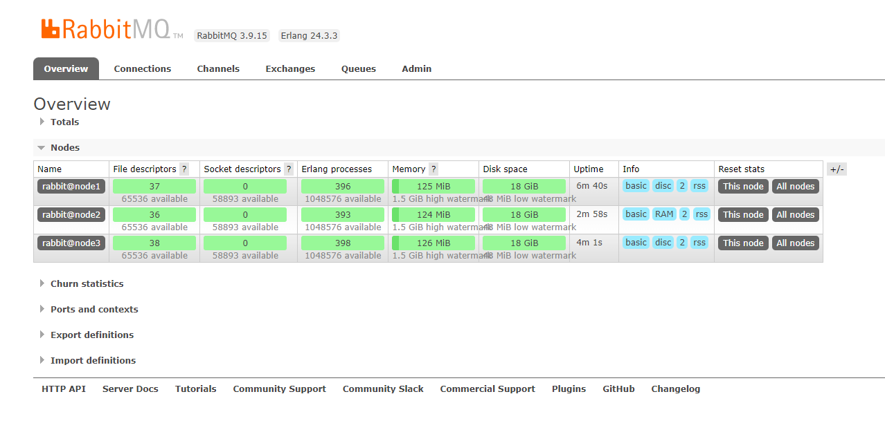

## 网络分区(脑裂)

### 一、啥是网络分区
当一个集群发生网络分区时，集群会分为两个部分或者更多，它们各自为政，互相都认为对方分区内的节点已经挂了。
包括队列、交换器及绑定等元数据的创建和销毁都处于自身分区内，与其他分区无关。
一般情况下，网络分区都是由于单个节点的故障引起的，且通常会形成一个大分区和一个单节点分区，如果配置了HA，那么可以在不影响服务可用性的情况下从网络分区的情形下得以恢复。

### 二、网络分区发生时的手动恢复方案

#### 方案一
先选择一个信任的分区(发生在其他分区的改变将不被记录到Mnesia中而直接丢弃)。 然后重启其它分区里的节点。 其它节点重启完后，之后重新将这些节点加入到当前信任的分区之中。
然后再重启这个受信任分区里的节点， 来去除告警。

#### 方案二
先关闭所有的节点，选择一个信任的分区，然后再优先启动这个受信任分区里的节点， 之后再启动其它节点。

### 三、实记解决网络分区问题

> 有一个3节点的RabbitMQ HA集群， 3个节点分别在3个物理机上。 因为某些原因，导致节点1所在的物理机，和节点2、节点3所在的物理机网络中断。 RabbitMQ管理界面如下：

节点1界面：

节点2界面：

### 恢复步骤：

1. 选择受信任分区的节点： 我们选择node3作为受信节点

2. 选用上面方案一来执行恢复步骤： 重启node1 -> 重启node2 -> 重启node3

启动后 ，管理界面显示如下

