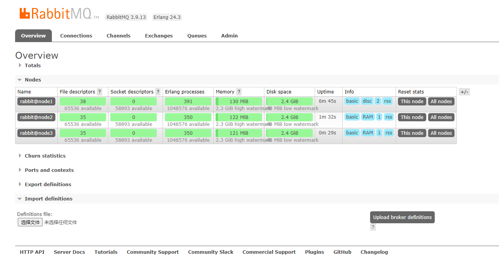

## 部署RabbitMQ集群

```
Tips: 本流程使用的操作系统是 Centos7, 采用 docker-compose的方式部署
```

### 一、步骤

> 1. 准备三台机器, 分别修改主机名称为 node1, node2, node3
```
hostnamectl set-hostname node1
hostnamectl set-hostname node2
hostnamectl set-hostname node3
```

> 2. 按照规划，修改/etc/hosts文件 (请根据实际情况，规划数据节点、内存节点、监控节点)：

| 节点名称 | IP    | 节点类型 |
| -----   | ----- | ----   |
|  node1  | 178.108.224.8   | 主节点   |
|  node2  | 178.108.224.9   | 内存节点  |
|  node3  | 178.108.224.10  | 内存节点  |

```
## vi /etc/hosts 文件, 增加下面内容

178.108.224.8 node1
178.108.224.9 node2
178.108.224.10 node3
```

> 3. 准备好 rabbitmq.yaml文件（详见下面附件）， 放在 /opt/rabbitmq 目录下

> 4. 在3个节点，分别执行 rabbit_install.sh 文件. （详见下面附件）

> 5. 在主节点执行下面命令
```
docker exec rabbitmq /bin/bash -c 'rabbitmqctl stop_app'
docker exec rabbitmq /bin/bash -c 'rabbitmqctl reset'
docker exec rabbitmq /bin/bash -c 'rabbitmqctl start_app'
docker exec rabbitmq /bin/bash -c 'rabbitmq-plugins enable rabbitmq_management'
```

> 6. 在从节点执行下面命令
```
## 加入主节点
docker exec rabbitmq /bin/bash -c 'rabbitmqctl stop_app'
docker exec rabbitmq /bin/bash -c 'rabbitmqctl reset'
docker exec rabbitmq /bin/bash -c 'rabbitmqctl join_cluster --ram rabbit@node1'
docker exec rabbitmq /bin/bash -c 'rabbitmqctl start_app'
```

> 7. 开启统计
```
## 进入容器，将 /etc/rabbitmq/conf.d//management_agent.disable_metrics_collector.conf 中的值改为 false
docker exec -it rabbitmq /bin/bash
echo 'management_agent.disable_metrics_collector = false' > /etc/rabbitmq/conf.d//management_agent.disable_metrics_collector.conf

## 然后重启容器
docker restart rabbitmq
```

最终效果如下：




### 附一、rabbit_install.sh 文件内容

```
## 安装docker
sudo yum install -y yum-utils device-mapper-persistent-data lvm2 
sudo yum-config-manager --add-repo https://download.docker.com/linux/centos/docker-ce.repo
sudo yum install -y https://download.docker.com/linux/centos/7/x86_64/stable/Packages/containerd.io-1.2.6-3.3.el7.x86_64.rpm
sudo yum install -y docker-ce docker-ce-cli containerd.io

## 通过pip安装 docker-compose
yum install -y python36
pip3 install --upgrade pip
pip3 install docker-compose -i https://pypi.mirrors.ustc.edu.cn/simple/ 

## 重启docker服务
systemctl restart docker

## 开放 4369 & 5672 &15672 & 25672 端口, 注意：如果是机器是在云平台上，记得要去修改安全组的下行规则
firewall-cmd --permanent --zone=public --add-port=4369/tcp
firewall-cmd --permanent --zone=public --add-port=5672/tcp
firewall-cmd --permanent --zone=public --add-port=15672/tcp
firewall-cmd --permanent --zone=public --add-port=25672/tcp
firewall-cmd --reload
systemctl restart firewalld.service


## 创建必要的目录 & 赋权限 -- 用于在 rabbitmq.yaml 文件中挂载
docker stop rabbitmq
docker rm rabbitmq
rm /var/lib/rabbitmq -rf
rm /var/log/rabbitmq -rf
mkdir /var/lib/rabbitmq
mkdir /var/log/rabbitmq
chmod 777 /var/lib/rabbitmq
chmod 777 /var/log/rabbitmq
echo 'rabbitmq_cluster_cookie' > /var/lib/rabbitmq/.erlang.cookie
chmod 600 /var/lib/rabbitmq/.erlang.cookie

## 拉取 rabbitmq镜像
docker pull rabbitmq:latest

## 启动rabbitmq
docker-compose -f /opt/rabbitmq/rabbitmq.yaml up -d
```


### 附二、rabbitmq.yaml 文件内容
```
version: '3.1'
services:
  rabbitmq:
    image: rabbitmq:latest       
    network_mode: "host" # 网络模式使用主机模式 
    container_name: rabbitmq
    privileged: true
    volumes:    
      - /var/lib/rabbitmq:/var/lib/rabbitmq  #挂载数据   
      - /var/log/rabbitmq:/var/log/rabbitmq   #挂载日志
      - /usr/share/zoneinfo/Asia/Shanghai:/etc/localtime
    environment:
      - RABBITMQ_DEFAULT_USER=smart
      - RABBITMQ_DEFAULT_PASS=123456
    restart: always
```

