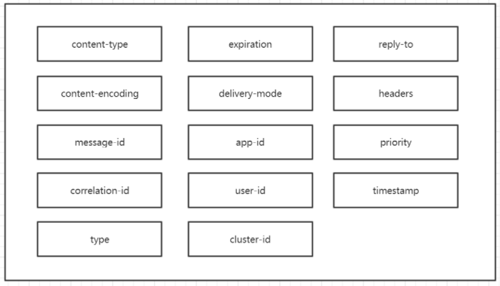

## 消息 (Message)

### 参考文档
> 1. https://www.pianshen.com/article/19451397954/ (RabbitMQ BasicProperties)


### 1. 声明消息的参数
```
就俩参数: 
     body (消息内容) 
     messageProperties (消息属性)

构造方法：
public Message(byte[] body, MessageProperties messageProperties) { 
	this.body = body;
	this.messageProperties = messageProperties;
}
```


### 2. 消息属性




<b>1. content-type</b>: 

> 用于描述消息体的数据格式，如同各种标准化的HTTP规范，content-type传输消息体也可以使用MIME类型。例如，如果应用程序正在发送JSON序列化的数据值，那么可以将content-type设置为application/json。如果客户端支持自动序列化，可以在消费消息时，帮你进行序列化的工作。

<b>2. content-encoding</b>: 

> 默认情况下，通过AMQP发送的消息不会被压缩。但如果在消息数量较大的场景下，则可能会希望对消息进行压缩。AMQP提供了content-encoding属性设置压缩编码：

<b>3. message-id</b>:

> 可以存放消息的唯一标识

<b>4. correlation-id</b>:

> 可以指定该消息是另一个消息的响应（另一个消息的标识）
```
Tips: 在AMQP规范中，message-id和correlation-id是“应用级别使用”的属性，原则上，你可以利用它们实现任何目的。这两个字段允许255个字节的UTF-8编码数据，并以未压缩的方式存储在Basic.Properties数据结构中
```


<b>5. expiration</b>:
> 该属性会告诉RabbitMQ何时应该丢弃消息。它的格式是一个短字符串，允许255个字符。
> 
> 想要利用expiration属性来实现RabbitMQ消息的自动过期，它必须包含一个UNIX纪元时间或整数时间戳，然后把它存储为字符串。如果把一个已经超时的消息发布到服务器，则该消息不会被路由到任何队列，而是被直接丢弃。
>
> RabbitMQ还有一个可以让消息过期的功能，在声明队列时，将一个x-message-ttl参数和队列定义在一起，这个值也是一个UNIX纪元时间戳，精度是毫秒，数据类型是整数值。


<b>6. delivery-mode </b>: 

> delivery-mode可能是很多人研发人员最感兴趣的一个属性，因为它关乎与RabbitMQ的性能。它表示在将消息投递给任何消费者之前，是否希望先将它持久化到磁盘上.
>
> delivery-mode有2个值：1(nopersistent) 表示非持久化消息;  2(persistent) 表示持久化消息

```
Tips: 不要把消息持久化和队列持久化（durable）混淆，队列持久化是告诉RabbitMQ队列的定义在重启RabbitMQ后是否仍然有效。只有设置了消息的delivery-mode才会告诉RabbitMQ消息是否应该被持久化。一个队列可能包含持久化和未持久化的消息。
```

<b>7. userId</b>:

> 一般用于存放已经登录的用户信息

<b>8. appId</b>：

> 在AMQP规范中定义为“短字符串”, 在生成消息时可以使用app-id传递特定API和版本号。可加强使用app-id可以更容易地追踪恶意消息的来源。

<b>9. headers</b>:

> 与其他属性不同，header属性允许你添加任何想要添加的数据到消息头表中。并且，RabbitMQ可以根据headers表中填充的值来路由消息，而不需要依赖路由键. 类型为Map<String,Object>

<b>10. priority</b>:

> priority字段实现为无符号字节，所以优先级可以是0~255，但实际使用时，应该被限制在0~9之间.


<b>11. reply-to</b>:

> 使用reply-to可以构件一个用来恢复消息的私有响应队列。这个定义中有大多的不明确性，所以使用起来需谨慎。


<b>12. timestamp</b>:

> 通过使用timestamp属性来指示消息的创建时间，消费者可以用来评估消息投递过程的性能。
> 
> 该属性没有时区上下文，因此建议在所有消息中使用UTC或其他统一的时区。

<b>13. type</b>:

> type属性被定义为“消息类型名称”，一般可以用于描述消息中的内容，应用程序可以根据它来确定如何处理一个消息。


<b>14. clusterId/reserved</b>:

> cluster-id属性在AMQP0-8中定义的，但随后被删除。
>
> AMQP0-9-1将其重命名为reserved，并声明它必须为空，虽然RabbitMQ目前没有根据规范要求它是空的，但你最好完全规避它。
