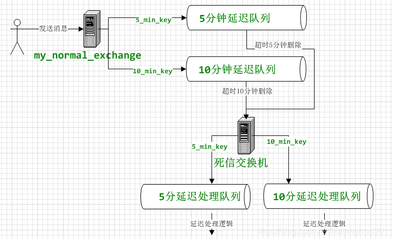

## 高级用法 - 死信队列

> 1. TTL
> 2. 死信队列(DLX)
> 3. 延时队列

### 一、TTL

#### 2.1 设置消息过期
> 为单条消息设置过期时间

```
问题： 最大值是多少？
```

#### 2.2 设置队列过期
> 为整个队列里的消息，设置过期时间

```
问题： 最大值是多少？
```

#### 2.3 说明
> 1. 上面两者都设置的话， 时间短的先生效。
> 
> 2. 如果队列头部消息未过期，队列中级消息已经过期，消息还在队列里面。

### 二、死信队列(DLX)

> 死信队列, DLX全称为Dead-Letter-Exchange , 可以称之为死信交换机，也有人称之为死信邮箱。 当消息在一个队列中变成死信(dead message)之后，它能被重新发送到另一个交换机中，这个交换机就是DLX ，绑定DLX的队列就称之为死信队列.

#### 2.1  什么样的消息会进入死信队列
> 1. 消息被拒绝（basic.reject/ basic.nack）, 并且不再重新投递 requeue=false
> 
> 2. TTL(time-to-live) 消息超时未消费
> 
> 3. 达到最大队列长度

### 三、延迟队列
> 1. 理用TTL和死信队列，实现延迟处理逻辑的目的。 比如：系统未付款的订单，超过一定时间后，需要系统自动取消订单并释放占有物品

#### 3.1 流转图



