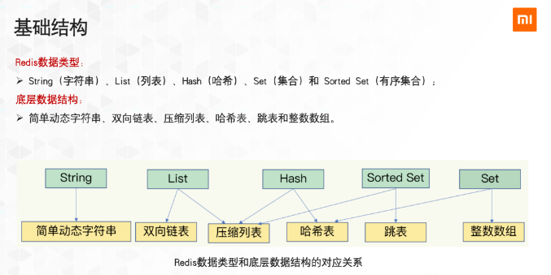

# Redis 数据类型和数据结构

## 一、参考内容
> https://mp.weixin.qq.com/s?__biz=Mzg3OTU5NzQ1Mw==&mid=2247483818&idx=1&sn=93de375daf847639d43ade4b3b8c8478&chksm=cf034348f874ca5ee3cf886cc32d41e788082b0ff68289c0bc584c801d7c4662290d99925504&token=179129384&lang=zh_CN&scene=21#wechat_redirect
> https://blog.csdn.net/qq_40714246/article/details/121596401

## 二、数据类型和数据结构对应关系
| 数据类型 | 数据结构 | 应用场景 |
| ------- | ------- | ------- |
| String  | 简单动态字符串(SDS)|	存储字符串信息 |
| List    | Linkedlist(双向链表)、Ziplist压缩列表 | 消息队列或栈的实现 |
| Hash    | Hashtable(哈希表)、Ziplist(压缩列表)  | 存储键值对信息     |
| Set     | Hashtable(哈希表)、Intset(整数集合)   | 存储非重复元素    |
| Sorted set    | Ziplist(压缩列表)、SkipList(跳表)     | 热搜榜、基于Timeline的排序 |
| Geospatial  |	|	用于获取地理位置信息 |
| Hyperloglog | |	统计基数个数        |
| Bitmap      | | 	活跃(非活跃)、在线(离线)等只有两种状态的情景 |



## 三、数据结构

### 3.1 简单动态字符串(SDS)
```
struct sdshdr{
  
  // 记录buf数组中已使用字节的数量
  // 等于SDS所保存字符串的长度
  int len;
  
  // 记录buf数组中未使用字节的数量
  int free;
  
  // 字节数组，用于保存字符串
  char buf[];
}
```
#### 3.1.1 查询字符串长度，时间是O(1)
> 从结构中可看出，SDS自己保存了存储字符串的长度，所以查询字符串长度时，时间是 O(1);

#### 3.1.2 空间预分配
> **用于优化字符串增长操作**： 当对SDS进行增长操作，需要进行空间扩展的时候，程序不仅会对为SDS分配所需要的空间，还会分配额外的未使用空间.

##### 预分配规则
* 当SDS长度(len的值)小于1MB, 将分配和len一样大小的未使用空间； - 比如分配后，len变成13，则free也变成13，则buf数组实际大小为 13byte + 13byte + 1byte = 27 byte (1byte用于保存空字符串)

* 当SDS长度(len的值)大于等于1MB, 将分配1MB的未使用空间；- 比如分配后，len变成30MB，则free变成1MB，则buf数组实际大小为 30MB + 1MB + 1byte

#### 3.1.3 惰性释放
> **用于优化字符串缩短操作**：当对SDS进行缩短操作，程序不会立即使用内存重分配来回收内存，而是使用free属性将其记录下来，等待将来使用.

#### 3.1.4 二进制安全
* C语言的字符串，是用'\0'来表示字符串结尾的，如果有一个字符串内容是 Hello\0World, 在C里会被识别为Hello.  
* SDS使用len来表示字符串的长度，可以做到输入和输出完全一致

### 3.2 链表

* 链表结构
```
typedef struct list{
    // 表头节点
    listNode *head;
    // 表位节点
    listNode *tail;
    // 链表所包含的节点数量
    unsigned long len;
    // 节点值复制函数
    void *(*dup)(void *ptr);
    // 节点值释放函数
    void (*free)(void *ptr);
    // 节点值对比函数
    int (*match)(void *ptr, void *key);
}list;
```

* 链表节点结构
```
typedef struct listNode{
    // 前置节点
    struct listNode *prev;
    // 后置节点
    struct listNode *next;
    // 节点的值
    void *value;
}listNode;
```

### 3.3 字典 (Hash)
* 字典结构
```
typedef struct dict{
 
  // 类型特定函数
  dictType *type;
  
  // 私有数据
  void *privdata;
  
  // 哈希表
  dictht ht[2];
  
  // rehash 索引
  // 当rehash不在进行时，值为-1
  int trehashidx;
}dict;
```

### 3.4 跳表

### 3.5 整数集合
