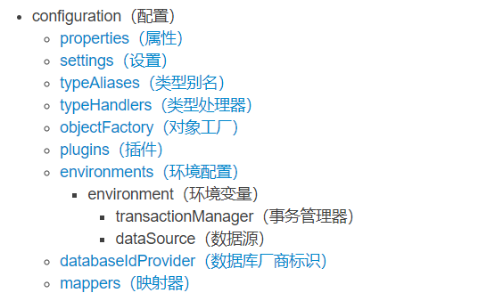

# MyBatis配置详解

### 参考文章
> https://mybatis.org/mybatis-3/zh/configuration.html#properties


## 一、引入Mybatis配置文件
在 **application.properties** 文件里，设置mybatis的配置文件路径
```
#设置mybatis的配置文件路径
mybatis.config-location=mybatis-config.xml
```
然后，初始化传创建一个mybatis-config.xml文件
```
# 初始化文件内容，啥都没有，就一个标签
<configuration>
   
</configuration>
```

## 二、配置具体信息

> MyBatis配置文件共有9个部分组成：



### 1. properties (属性)

#### 1.1 在 mybatis-config.xml文件里，增加 <**properties**> 标签
```
<configuration>
    <!--引入配置文件-->
    <properties resource="db.properties">
        <property name="username" value="root"/>
        <property name="password" value="123456"/>
    </properties>
</configuration>
```

#### 1.2 配置单独的db连接信息 db.properties
```
# mysql
driver=com.mysql.cj.jdbc.Driver
url=jdbc:mysql://124.223.2.131:3306/spring2X?characterEncoding=utf8&useSSL=false&serverTimezone=Asia/Shanghai&rewriteBatchedStatements=true
username=root
password=123456
```

#### 注：
```
如果一个属性在不只一个地方进行了配置，那么，MyBatis 将按照下面的顺序来加载：

1. 首先读取在 properties 元素体内指定的属性。
2. 然后根据 properties 元素中的 resource 属性读取类路径下属性文件，或根据 url 属性指定的路径读取属性文件，并覆盖之前读取过的同名属性。
3. 最后读取作为方法参数传递的属性，并覆盖之前读取过的同名属性。

因此，通过方法参数传递的属性具有最高优先级，resource/url 属性中指定的配置文件次之，最低优先级的则是 properties 元素中指定的属性。
```


### 2. settings(设置)
> 这是 MyBatis 中极为重要的调整设置，它们会改变 MyBatis 的运行时行为. 可查看https://mybatis.org/mybatis-3/zh/configuration.html#properties 里找到详细说明

Demo:
```
<settings>
  <setting name="cacheEnabled" value="true"/>
  <setting name="lazyLoadingEnabled" value="true"/>
  <setting name="multipleResultSetsEnabled" value="true"/>
  <setting name="useColumnLabel" value="true"/>
  <setting name="useGeneratedKeys" value="false"/>
  <setting name="autoMappingBehavior" value="PARTIAL"/>
  <setting name="autoMappingUnknownColumnBehavior" value="WARNING"/>
  <setting name="defaultExecutorType" value="SIMPLE"/>
  <setting name="defaultStatementTimeout" value="25"/>
  <setting name="defaultFetchSize" value="100"/>
  <setting name="safeRowBoundsEnabled" value="false"/>
  <setting name="mapUnderscoreToCamelCase" value="false"/>
  <setting name="localCacheScope" value="SESSION"/>
  <setting name="jdbcTypeForNull" value="OTHER"/>
  <setting name="lazyLoadTriggerMethods" value="equals,clone,hashCode,toString"/>
</settings>
```

### 3. typeAliases(类型别名)
类型别名可为 Java 类型设置一个缩写名字。 它仅用于 XML 配置，意在降低冗余的全限定类名书写。例如：
```
<typeAliases>
  <typeAlias alias="Author" type="domain.blog.Author"/>
  <typeAlias alias="Blog" type="domain.blog.Blog"/>
  <typeAlias alias="Comment" type="domain.blog.Comment"/>
  <typeAlias alias="Post" type="domain.blog.Post"/>
  <typeAlias alias="Section" type="domain.blog.Section"/>
  <typeAlias alias="Tag" type="domain.blog.Tag"/>
</typeAliases>
```
当这样配置时，Blog 可以用在任何使用 domain.blog.Blog 的地方。

也可以指定一个包名，MyBatis 会在包名下面搜索需要的 Java Bean，比如：
```
<typeAliases>
  <package name="domain.blog"/>
</typeAliases>
```
每一个在包 domain.blog 中的 Java Bean，在没有注解的情况下，会使用 Bean 的首字母小写的非限定类名来作为它的别名。 比如 domain.blog.Author 的别名为 author；若有注解，则别名为其注解值。见下面的例子：
```
@Alias("author")
public class Author {
...
}
```


### 4.typeHandlers(类型处理器) 


### 5.objectFactory(对象工厂)

每次 MyBatis 创建结果对象的新实例时，它都会使用一个对象工厂（ObjectFactory）实例来完成实例化工作。 默认的对象工厂需要做的仅仅是实例化目标类，要么通过默认无参构造方法，要么通过存在的参数映射来调用带有参数的构造方法。

如果想覆盖对象工厂的默认行为，可以通过创建自己的对象工厂来实现。比如：
```
// ExampleObjectFactory.java
public class ExampleObjectFactory extends DefaultObjectFactory {
    @Override
    public <T> T create(Class<T> type) {
        return super.create(type);
    }

    @Override
    public <T> T create(Class<T> type, List<Class<?>> constructorArgTypes, List<Object> constructorArgs) {
        return super.create(type, constructorArgTypes, constructorArgs);
    }

    @Override
    public void setProperties(Properties properties) {
        super.setProperties(properties);
    }

    @Override
    public <T> boolean isCollection(Class<T> type) {
        return Collection.class.isAssignableFrom(type);
    }
}
```
```
<!-- mybatis-config.xml -->
<objectFactory type="org.mybatis.example.ExampleObjectFactory">
    <property name="someProperty" value="100"/>
</objectFactory>
```
ObjectFactory 接口很简单，它包含两个创建实例用的方法，一个是处理默认无参构造方法的，另外一个是处理带参数的构造方法的。 另外，setProperties 方法可以被用来配置 ObjectFactory，在初始化你的 ObjectFactory 实例后， objectFactory 元素体中定义的属性会被传递给 setProperties 方法。

### 6.plugins(插件)

MyBatis 允许你在映射语句执行过程中的某一点进行拦截调用。默认情况下，MyBatis 允许使用插件来拦截的方法调用包括：
```
Executor (update, query, flushStatements, commit, rollback, getTransaction, close, isClosed)
ParameterHandler (getParameterObject, setParameters)
ResultSetHandler (handleResultSets, handleOutputParameters)
StatementHandler (prepare, parameterize, batch, update, query)
```
这些类中方法的细节可以通过查看每个方法的签名来发现，或者直接查看 MyBatis 发行包中的源代码。

如果你想做的不仅仅是监控方法的调用，那么你最好相当了解要重写的方法的行为。 因为在试图修改或重写已有方法的行为时，很可能会破坏 MyBatis 的核心模块。 这些都是更底层的类和方法，所以使用插件的时候要特别当心。

通过 MyBatis 提供的强大机制，使用插件是非常简单的，只需实现 Interceptor 接口，并指定想要拦截的方法签名即可。
```
// ExamplePlugin.java
@Intercepts(
 {
  @Signature(
        type= Executor.class,
        method = "update",
        args = {MappedStatement.class,Object.class}
    )
 }
)
public class ExamplePlugin implements Interceptor {

    private Properties properties = new Properties();

    @Override
    public Object intercept(Invocation invocation) throws Throwable {
        // implement pre processing if need
        Object returnObject = invocation.proceed();
        // implement post processing if need
        return returnObject;
    }

    @Override
    public void setProperties(Properties properties) {
        this.properties = properties;
    }
}
```
```
<!-- mybatis-config.xml -->
<plugins>
  <plugin interceptor="org.mybatis.example.ExamplePlugin">
    <property name="someProperty" value="100"/>
  </plugin>
</plugins>
```
上面的插件将会拦截在 Executor 实例中所有的 “update” 方法调用， 这里的 Executor 是负责执行底层映射语句的内部对象。

提示 覆盖配置类

除了用插件来修改 MyBatis 核心行为以外，还可以通过完全覆盖配置类来达到目的。只需继承配置类后覆盖其中的某个方法，再把它传递到 SqlSessionFactoryBuilder.build(myConfig) 方法即可。再次重申，这可能会极大影响 MyBatis 的行为，务请慎之又慎。


### 7.databaseIdProvider(数据库厂商标志) 

MyBatis 可以根据不同的数据库厂商执行不同的语句，这种多厂商的支持是基于映射语句中的 databaseId 属性。 MyBatis 会加载带有匹配当前数据库 databaseId 属性和所有不带 databaseId 属性的语句。 如果同时找到带有 databaseId 和不带 databaseId 的相同语句，则后者会被舍弃。 为支持多厂商特性，只要像下面这样在 mybatis-config.xml 文件中加入 databaseIdProvider 即可：
```
    <databaseIdProvider type="DB_VENDOR" />
```
databaseIdProvider 对应的 DB_VENDOR 实现会将 databaseId 设置为 DatabaseMetaData#getDatabaseProductName() 返回的字符串。 由于通常情况下这些字符串都非常长，而且相同产品的不同版本会返回不同的值，你可能想通过设置属性别名来使其变短：
```
<databaseIdProvider type="DB_VENDOR">
  <property name="SQL Server" value="sqlserver"/>
  <property name="DB2" value="db2"/>
  <property name="Oracle" value="oracle" />
</databaseIdProvider>
```
在提供了属性别名时，databaseIdProvider 的 DB_VENDOR 实现会将 databaseId 设置为数据库产品名与属性中的名称第一个相匹配的值，如果没有匹配的属性，将会设置为 “null”。 在这个例子中，如果 getDatabaseProductName() 返回“Oracle (DataDirect)”，databaseId 将被设置为“oracle”。

你可以通过实现接口 org.apache.ibatis.mapping.DatabaseIdProvider 并在 mybatis-config.xml 中注册来构建自己的 DatabaseIdProvider：
```
public interface DatabaseIdProvider {
    
    default void setProperties(Properties p) { // 从 3.5.2 开始，该方法为默认方法
        // 空实现
    }
    
    String getDatabaseId(DataSource dataSource) throws SQLException;
}
```


### 8.environments(数据库环境) 

MyBatis 可以配置成适应多种环境，这种机制有助于将 SQL 映射应用于多种数据库之中， 现实情况下有多种理由需要这么做。例如，开发、测试和生产环境需要有不同的配置；或者想在具有相同 Schema 的多个生产数据库中使用相同的 SQL 映射。还有许多类似的使用场景。

不过要记住：尽管可以配置多个环境，但每个 SqlSessionFactory 实例只能选择一种环境。

所以，如果你想连接两个数据库，就需要创建两个 SqlSessionFactory 实例，每个数据库对应一个。而如果是三个数据库，就需要三个实例，依此类推，记起来很简单：

每个数据库对应一个 SqlSessionFactory 实例
为了指定创建哪种环境，只要将它作为可选的参数传递给 SqlSessionFactoryBuilder 即可。可以接受环境配置的两个方法签名是：
```
SqlSessionFactory factory = new SqlSessionFactoryBuilder().build(reader, environment);
SqlSessionFactory factory = new SqlSessionFactoryBuilder().build(reader, environment, properties);
```
如果忽略了环境参数，那么将会加载默认环境，如下所示：
```
SqlSessionFactory factory = new SqlSessionFactoryBuilder().build(reader);
SqlSessionFactory factory = new SqlSessionFactoryBuilder().build(reader, properties);
```

* **environments** 元素定义了如何配置环境。
```
<environments default="development">
  <environment id="development">
    <transactionManager type="JDBC">
      <property name="..." value="..."/>
    </transactionManager>
    <dataSource type="POOLED">
      <property name="driver" value="${driver}"/>
      <property name="url" value="${url}"/>
      <property name="username" value="${username}"/>
      <property name="password" value="${password}"/>
    </dataSource>
  </environment>
</environments>
```
* 注意一些关键点:

1. 默认使用的环境 ID（比如：default="development"）。
2. 每个 environment 元素定义的环境 ID（比如：id="development"）。
3. 事务管理器的配置（比如：type="JDBC"）。
4. 数据源的配置（比如：type="POOLED"）。
默认环境和环境 ID 顾名思义。 环境可以随意命名，但务必保证默认的环境 ID 要匹配其中一个环境 ID。

#### 事务管理器（transactionManager）

在 MyBatis 中有两种类型的事务管理器（也就是 type="[JDBC|MANAGED]"）：

JDBC – 这个配置直接使用了 JDBC 的提交和回滚功能，它依赖从数据源获得的连接来管理事务作用域。默认情况下，为了与某些驱动程序兼容，它在关闭连接时启用自动提交。然而，对于某些驱动程序来说，启用自动提交不仅是不必要的，而且是一个代价高昂的操作。因此，从 3.5.10 版本开始，你可以通过将 "skipSetAutoCommitOnClose" 属性设置为 "true" 来跳过这个步骤。例如：
```
<transactionManager type="JDBC">
    <property name="skipSetAutoCommitOnClose" value="true"/>
</transactionManager>
```

MANAGED – 这个配置几乎没做什么。它从不提交或回滚一个连接，而是让容器来管理事务的整个生命周期（比如 JEE 应用服务器的上下文）。 默认情况下它会关闭连接。然而一些容器并不希望连接被关闭，因此需要将 closeConnection 属性设置为 false 来阻止默认的关闭行为。例如:
```
<transactionManager type="MANAGED">
    <property name="closeConnection" value="false"/>
</transactionManager>
```
提示 如果你正在使用 Spring + MyBatis，则没有必要配置事务管理器，因为 Spring 模块会使用自带的管理器来覆盖前面的配置。

这两种事务管理器类型都不需要设置任何属性。它们其实是类型别名，换句话说，你可以用 TransactionFactory 接口实现类的全限定名或类型别名代替它们。
```
public interface TransactionFactory {
    default void setProperties(Properties props) { // 从 3.5.2 开始，该方法为默认方法
        // 空实现
    }
    
    Transaction newTransaction(Connection conn);
    
    Transaction newTransaction(DataSource dataSource, TransactionIsolationLevel level, boolean autoCommit);
}
```
在事务管理器实例化后，所有在 XML 中配置的属性将会被传递给 setProperties() 方法。你的实现还需要创建一个 Transaction 接口的实现类，这个接口也很简单：
```
public interface Transaction {
    Connection getConnection() throws SQLException;
    void commit() throws SQLException;
    void rollback() throws SQLException;
    void close() throws SQLException;
    Integer getTimeout() throws SQLException;
}
```
使用这两个接口，你可以完全自定义 MyBatis 对事务的处理。

#### 数据源（dataSource）

dataSource 元素使用标准的 JDBC 数据源接口来配置 JDBC 连接对象的资源。

大多数 MyBatis 应用程序会按示例中的例子来配置数据源。虽然数据源配置是可选的，但如果要启用延迟加载特性，就必须配置数据源。

有三种内建的数据源类型（也就是 type=" **UNPOOLED** | **POOLED** | **JNDI** "）：

**UNPOOLED** 
> 这个数据源的实现会每次请求时打开和关闭连接。虽然有点慢，但对那些数据库连接可用性要求不高的简单应用程序来说，是一个很好的选择。 性能表现则依赖于使用的数据库，对某些数据库来说，使用连接池并不重要，这个配置就很适合这种情形。UNPOOLED 类型的数据源仅仅需要配置以下 5 种属性：

* <font color=red>**driver**</font>  
  这是 JDBC 驱动的 Java 类全限定名（并不是 JDBC 驱动中可能包含的数据源类）。
* <font color=red>**url**</font>  
  – 这是数据库的 JDBC URL 地址。
* <font color=red>**username**</font>  
  – 登录数据库的用户名。
* <font color=red>**password**</font>  
  – 登录数据库的密码。
* <font color=red>**defaultTransactionIsolationLevel**</font>  
  – 默认的连接事务隔离级别。
* <font color=red>**defaultNetworkTimeout**</font>  
  – 等待数据库操作完成的默认网络超时时间（单位：毫秒）。查看 java.sql.Connection#setNetworkTimeout() 的 API 文档以获取更多信息。
作为可选项，你也可以传递属性给数据库驱动。只需在属性名加上“driver.”前缀即可，例如：
* <font color=red>**driver.encoding=UTF8**</font>  
  这将通过 DriverManager.getConnection(url, driverProperties) 方法传递值为 UTF8 的 encoding 属性给数据库驱动。

POOLED
> 这种数据源的实现利用“池”的概念将 JDBC 连接对象组织起来，避免了创建新的连接实例时所必需的初始化和认证时间。 这种处理方式很流行，能使并发 Web 应用快速响应请求。

除了上述提到 UNPOOLED 下的属性外，还有更多属性用来配置 POOLED 的数据源：

* <font color=red>**poolMaximumActiveConnections**</font>  
  – 在任意时间可存在的活动（正在使用）连接数量，默认值：10
* <font color=red>**poolMaximumIdleConnections**</font>  
  – 任意时间可能存在的空闲连接数。
* <font color=red>**poolMaximumCheckoutTime**</font>  
  – 在被强制返回之前，池中连接被检出（checked out）时间，默认值：20000 毫秒（即 20 秒）
* <font color=red>**poolTimeToWait**</font>  
  – 这是一个底层设置，如果获取连接花费了相当长的时间，连接池会打印状态日志并重新尝试获取一个连接（避免在误配置的情况下一直失败且不打印日志），默认值：20000 毫秒（即 20 秒）。
* <font color=red>**poolMaximumLocalBadConnectionTolerance**</font>  
  – 这是一个关于坏连接容忍度的底层设置， 作用于每一个尝试从缓存池获取连接的线程。 如果这个线程获取到的是一个坏的连接，那么这个数据源允许这个线程尝试重新获取一个新的连接，但是这个重新尝试的次数不应该超过 poolMaximumIdleConnections 与 poolMaximumLocalBadConnectionTolerance 之和。 默认值：3（新增于 3.4.5）
* <font color=red>**poolPingQuery**</font>  
  – 发送到数据库的侦测查询，用来检验连接是否正常工作并准备接受请求。默认是“NO PING QUERY SET”，这会导致多数数据库驱动出错时返回恰当的错误消息。
* <font color=red>**poolPingEnabled**</font>  
  – 是否启用侦测查询。若开启，需要设置 poolPingQuery 属性为一个可执行的 SQL 语句（最好是一个速度非常快的 SQL 语句），默认值：false。
* <font color=red>**poolPingConnectionsNotUsedFor**</font>  
  – 配置 poolPingQuery 的频率。可以被设置为和数据库连接超时时间一样，来避免不必要的侦测，默认值：0（即所有连接每一时刻都被侦测 — 当然仅当 poolPingEnabled 为 true 时适用）。


**JNDI**
> 这个数据源实现是为了能在如 EJB 或应用服务器这类容器中使用，容器可以集中或在外部配置数据源，然后放置一个 JNDI 上下文的数据源引用。这种数据源配置只需要两个属性：

* <font color=red>**initial_context**</font>  
  – 这个属性用来在 InitialContext 中寻找上下文（即，initialContext.lookup(initial_context)）。这是个可选属性，如果忽略，那么将会直接从 InitialContext 中寻找 data_source 属性。
* <font color=red>**data_source**</font>  
  – 这是引用数据源实例位置的上下文路径。提供了 initial_context 配置时会在其返回的上下文中进行查找，没有提供时则直接在 InitialContext 中查找。
和其他数据源配置类似，可以通过添加前缀“env.”直接把属性传递给 InitialContext。比如：

* <font color=red>**env.encoding=UTF8**</font>  
  -这就会在 InitialContext 实例化时往它的构造方法传递值为 UTF8 的 encoding 属性。


你可以通过实现接口 org.apache.ibatis.datasource.DataSourceFactory 来使用第三方数据源实现：
```
public interface DataSourceFactory {
    
    void setProperties(Properties props);

    DataSource getDataSource();
}
```
org.apache.ibatis.datasource.unpooled.UnpooledDataSourceFactory 可被用作父类来构建新的数据源适配器，比如下面这段插入 C3P0 数据源所必需的代码：
```
import org.apache.ibatis.datasource.unpooled.UnpooledDataSourceFactory;
import com.mchange.v2.c3p0.ComboPooledDataSource;

public class C3P0DataSourceFactory extends UnpooledDataSourceFactory {

    public C3P0DataSourceFactory() {
        this.dataSource = new ComboPooledDataSource();
    }
}
```
为了令其工作，记得在配置文件中为每个希望 MyBatis 调用的 setter 方法增加对应的属性。 下面是一个可以连接至 PostgreSQL 数据库的例子：
```
<dataSource type="org.myproject.C3P0DataSourceFactory">
  <property name="driver" value="org.postgresql.Driver"/>
  <property name="url" value="jdbc:postgresql:mydb"/>
  <property name="username" value="postgres"/>
  <property name="password" value="root"/>
</dataSource>
```

### 9.mappers(映射器)

既然 MyBatis 的行为已经由上述元素配置完了，我们现在就要来定义 SQL 映射语句了。 但首先，我们需要告诉 MyBatis 到哪里去找到这些语句。 在自动查找资源方面，Java 并没有提供一个很好的解决方案，所以最好的办法是直接告诉 MyBatis 到哪里去找映射文件。 你可以使用相对于类路径的资源引用，或完全限定资源定位符（包括 file:/// 形式的 URL），或类名和包名等。例如：
```
<!-- 使用相对于类路径的资源引用 -->
<mappers>
  <mapper resource="org/mybatis/builder/AuthorMapper.xml"/>
  <mapper resource="org/mybatis/builder/BlogMapper.xml"/>
  <mapper resource="org/mybatis/builder/PostMapper.xml"/>
</mappers>

<!-- 使用完全限定资源定位符（URL） -->
<mappers>
  <mapper url="file:///var/mappers/AuthorMapper.xml"/>
  <mapper url="file:///var/mappers/BlogMapper.xml"/>
  <mapper url="file:///var/mappers/PostMapper.xml"/>
</mappers>

<!-- 使用映射器接口实现类的完全限定类名 -->
<mappers>
  <mapper class="org.mybatis.builder.AuthorMapper"/>
  <mapper class="org.mybatis.builder.BlogMapper"/>
  <mapper class="org.mybatis.builder.PostMapper"/>
</mappers>

<!-- 将包内的映射器接口实现全部注册为映射器 -->
<mappers>
  <package name="org.mybatis.builder"/>
</mappers>
```
这些配置会告诉 MyBatis 去哪里找映射文件，剩下的细节就应该是每个 SQL 映射文件了，也就是接下来我们要讨论的。

  