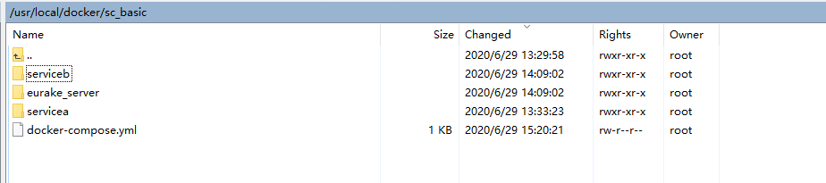
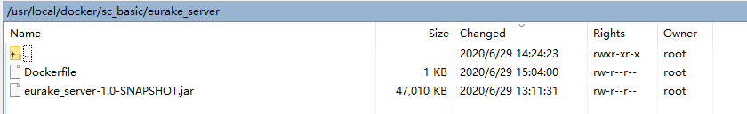
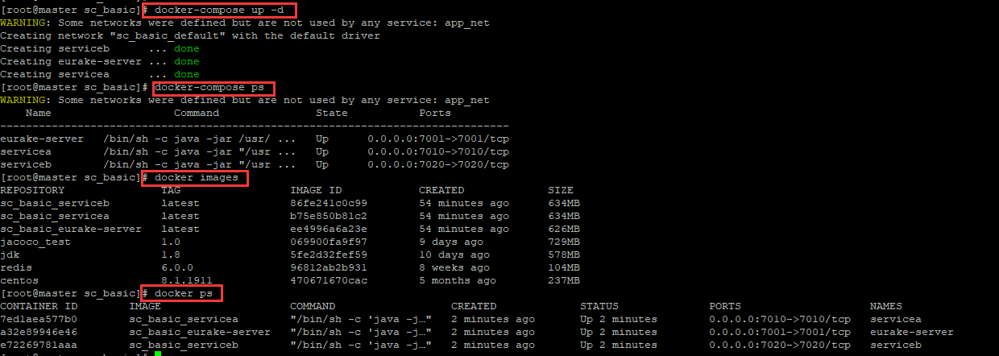
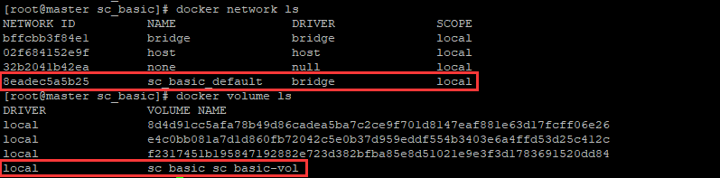
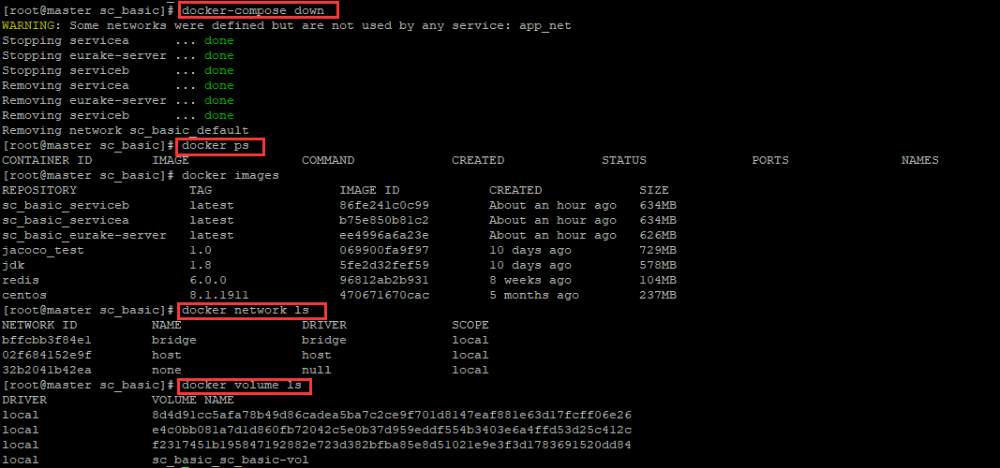

## 使用Docker Compose部署应用
> Tips: 本文内容以 《深入简出Docker》 第九章 <使用Docker Compose部署应用> 为基础， 并结合其它内容和个人理解而成 

### 一、简介

&emsp; 现在的应用，很多是通过多个更小的服务组合而成，比如微服务架构。 然而管理、部署这些应用非常不便，这就是Docker Compose要解决的问题。
  
&emsp; Docker Compose 通过一个声明式的配置文件描述整个应用，从而使用一条命令完成部署。 部署后， 可以通过系列简单的命令实现对其完整生命周期的管理。 甚至，配置文件还可以置于版本控制系统中进行存储和管理。
  
### 二、详解

#### 2.1 背景
  
 &emsp; Docker Compose 的前身是 Fig。Fig 是一个由 Orchard 公司开发的强有力的工具，在当时是进行多容器管理的最佳方案。Fig 是一个基于 Docker 的 Python 工具，允许用户基于一个 YAML 文件定义多容器应用，从而可以使用 fig 命令行工具进行应用的部署。Fig 还可以对应用的全生命周期进行管理。内部实现上，Fig 会解析 YAML 文件，并通过 Docker API 进行应用的部署和管理。
 
 &emsp; 在 2014 年，Docker 公司收购了 Orchard 公司，并将 Fig 更名为 Docker Compose。命令行工具也从 fig 更名为 docker-compose，并自此成为绑定在 Docker 引擎之上的外部工具。虽然它从未完全集成到 Docker 引擎中，但是仍然受到广泛关注并得到普遍使用。直至今日，Docker Compose 仍然是一个需要在 Docker 主机上进行安装的外部 Python 工具。使用它时，首先编写定义多容器（多服务）应用的 YAML 文件，然后将其交由 docker-compose 命令处理，Docker Compose 就会基于 Docker 引擎 API 完成应用的部署。
  
#### 2.2 安装 Docker Compose

##### 1. Centos8 环境安装 docker compose:

&emsp; 1.1 要求： 先要有安装好的 Docker 引擎;

&emsp; 1.2 下载 Docker Compose

> curl -L "https://github.com/docker/compose/releases/download/1.26.0/docker-compose-$(uname -s)-$(uname -m)" -o /usr/local/bin/docker-compose

&emsp; 1.3 赋予其执行权限
 
 > chmod +x /usr/local/bin/docker-compose

&emsp; 1.4 检查安装情况及版本

> docker-compose --version
 
##### 2. 使用Pip安装 docker compose:
> 我自己通过上面的安装方法，并没能安装成功。 主要是因为从github上下载 docker-compose 包这一步网络不稳，下不下来。 改用pip来安装可以成功

 2.1 安装pip3 (centos8)

```
yum install -y python36
```

&emsp; 2.2 使用pip3安装 docker compose

```
pip3 install docker-compose

docker-compose --version             
```

#### 2.3 Compose文件

> Tips: 下面展示一下书上给的案例，只做demo使用。若想查看更多配置信息，可参照此篇blog (https://www.jianshu.com/p/90bf0e231e5a) 

Docker Compose 使用 YAML 文件来定义多服务的应用。YAML 是 JSON 的一个子集，因此也可以使用 JSON。Docker Compose 默认使用文件名 docker-compose.yml。当然，也可以使用 -f 参数指定具体文件。如下是一个简单的 Compose 文件的示例，它定义了一个包含两个服务（web-fe 和 redis）的小型 Flask 应用。这是一个能够对访问者进行计数并将其保存到 Redis 的简单的 Web 服务。

````
  version: "3.5"
  services:
    web-fe:
      build: .
      command: python app.py
      ports:
        - target: 5000
          published: 5000
      networks:
        - counter-net
      volumes:
        - type: volume
          source: counter-vol
          target: /code
    redis:
      image: "redis:alpine"
      networks:
        counter-net:
  
  networks:
    counter-net:
  
  volumes:
    counter-vol:
````

  &emsp;在深入研究之前粗略观察文件的基本结构，首先可以注意到，它包含 4 个一级 key：version、services、networks、volumes， 其它的key此处暂不讨论。
  
  &emsp;**version** 是必须指定的，而且总是位于文件的第一行。它定义了 Compose 文件格式（主要是 API）的版本。建议使用最新版，示例中 Compose 文件将使用版本 3 及以上的版本。注意，version 并非定义 Docker Compose 或 Docker 引擎的版本号。
  
  &emsp;**services** 用于定义不同的应用服务。上边的例子定义了两个服务：一个名为 web-fe 的 Web 前端服务以及一个名为 redis 的内存数据库服务。Docker Compose 会将每个服务部署在各自的容器中。
  
  &emsp;**networks** 用于指引 Docker 创建新的网络。默认情况下，Docker Compose 会创建 bridge 网络。这是一种单主机网络，只能够实现同一主机上容器的连接。当然，也可以使用 driver 属性来指定不同的网络类型。下面的代码可以用来创建一个名为 over-net 的 Overlay 网络，允许独立的容器（standalone container）连接（attachable）到该网络上。
  ````
  networks:
    over-net:
    driver: overlay
    attachable: true
  ````
  &emsp;**volumes** 用于指引 Docker 来创建新的卷。上面例子中的 Compose 文件使用的是 v3.5 版本的格式，定义了两个服务，一个名为 counter-net 的网络和一个名为 counter-vol 的卷。
  
  
  ##### &emsp; 更多的信息在 services 中，下面仔细分析一下：
  
 &emsp; Compose 文件中的 services 部分定义了两个二级 key：web-fe 和 redis。它们各自定义了一个应用程序服务。需要明确的是，Docker Compose 会将每个服务部署为一个容器，并且会使用 key 作为容器名字的一部分。本例中定义了两个 key：web-fe 和 redis。因此 Docker Compose 会部署两个容器，一个容器的名字中会包含 web-fe，而另一个会包含 redis。
  
  web-fe 的服务定义中，包含如下指令。
  
  * build
  
 &emsp; 指定 Docker 基于当前目录（.）下 Dockerfile 中定义的指令来构建一个新镜像。该镜像会被用于启动该服务的容器。
  
  * command
  
 &emsp; python app.py 指定 Docker 在容器中执行名为 app.py 的 Python 脚本作为主程序。因此镜像中必须包含 app.py 文件以及 Python，这一点在 Dockerfile 中可以得到满足。
  
  * ports
  
 &emsp; 指定 Docker 将容器内（-target）的 5000 端口映射到主机（published）的 5000 端口。这意味着发送到 Docker 主机 5000 端口的流量会被转发到容器的 5000 端口。容器中的应用监听端口 5000。
  
  * networks
  
 &emsp; 使得 Docker 可以将服务连接到指定的网络上。这个网络应该是已经存在的，或者是在 networks 一级 key 中定义的网络。对于 Overlay 网络来说，它还需要定义一个 attachable 标志，这样独立的容器才可以连接上它（这时 Docker Compose 会部署独立的容器而不是 Docker 服务）。
  
  * volumes
  
 &emsp; 指定 Docker 将 counter-vol 卷（source:）挂载到容器内的 /code（target:）。counter-vol 卷应该是已存在的，或者是在文件下方的 volumes 一级 key 中定义的。
 
 &emsp; 综上，Docker Compose 会调用 Docker 来为 web-fe 服务部署一个独立的容器。该容器基于与 Compose 文件位于同一目录下的 Dockerfile 构建的镜像。基于该镜像启动的容器会运行 app.py 作为其主程序，将 5000 端口暴露给宿主机，连接到 counter-net 网络上，并挂载一个卷到/code。
  
> 注： 从技术上讲，本例并不需要配置 command: python app.py。因为镜像的 Dockerfile 已经将 python app.py 定义为了默认的启动程序。但是，本例主要是为了展示其如何执行，因此也可用于覆盖 Dockerfile 中配置的 CMD 指令。
  

  redis 服务的定义相对比较简单:
  
  * image
  
  &emsp; redis:alpine 使得 Docker 可以基于 redis:alpine 镜像启动一个独立的名为 redis 的容器。 这个镜像会被从 Docker Hub 上拉取下来。
  
  * networks
  
   &emsp; 配置 redis 容器连接到 counter-net 网络。
  
   &emsp;由于两个服务都连接到 counter-net 网络，因此它们可以通过名称解析到对方的地址。了解这一点很重要，本例中上层应用被配置为通过名称与 Redis 服务通信。
  
  
#### 2.4 使用Docker Compose部署应用
> Tips: 因为我没有去下载本书配套源码，所以这个部分将采用我自己部署的项目来作为演示材料
 
  * 准备材料如下, 有三个目录，每个目录对应一个服务的资源文件， 还有一个 docker-compose.yml 文件
  
  
     
  
  
  docker-compose.yml 如下：
  ````
version: "3.5"

services:
  eurake-server:
    build: 
        context: /usr/local/docker/sc_basic/eurake_server
        dockerfile: Dockerfile
    #容器名称
    container_name: eurake-server
    #command:
    ports:
      - target: 7001
        published: 7001

  servicea:
    build: 
        context: /usr/local/docker/sc_basic/servicea
        dockerfile: Dockerfile
    container_name: servicea
    #command:
    ports:
      - target: 7010
        published: 7010

  serviceb:
    build: 
        context: /usr/local/docker/sc_basic/serviceb
        dockerfile: Dockerfile
    container_name: serviceb
    #command:
    ports:
      - target: 7020
        published: 7020

networks:
  app_net:
    driver: bridge

volumes:
  sc_basic-vol:
  ````
 
 
  * 使用 docker-compose up -d 命令来后台启动服务, 然后使用 docker-compose ps 命令查看启动的容器。 可以看到这里会自动的去创建镜像，创建容器。 同时还会根据 .yml 中的配置来创建网络和卷
  
  
  
  
  
#### 2.5 使用Docker Compose管理应用

##### 1. 常用的docker-compose命令：

* docker-compose -f [file] up -d: 构建所需要的镜像，创建网络和卷，并启动容器。

    * -f [file]: 指定配置文件，若不指定，默认查找当前路径下的 docker-compose.yml 或 docker-compose.yaml
    * -d : 后台启动服务

* docker-compose stop ： 命令会停止Compose应用相关的所有容器，但不会删除它们。 被停止的应用可通过 docker-compose restart 来重新启动

* docker-compose rm ： 用来删除已停止的compose应用。 它会删除容器和网络，但不会删除卷和镜像

* docker-compose restart : 该命令会重启已停止的compose应用， 如果用户在停止该应用后，对其做了变更，那变更的内容不会反映在重启后的应用中，这时需要重新部署应用使变更生效

* docker-compose ps : 该命令用于列出 Compose 应用中的各个容器。 输出的内容包括当前状态、容器运行的命令和网络端口

* docker-compose down: 该命令会停止并删除运行中的Compose应用。它会删除容器和网络，但不会删除卷和镜像

* docker-compose top ：该命令列出各个服务(容器)内运行的进程

* docker-compose images: 查看compose中包含的镜像

* docker-compose build [containerId]： 重建某个容器，在 Dockerfile 发生了改变的时候，可以重建image。然后再 up 运行起来所有的容器

##### 2. 下面执行以下 docker-compose down 作为demo演示以下。 可以看出来容器和网络已经被删除了， 但卷和镜像还在。

  
  
##### Tips:

* 如果我们此时再去执行up命令， 会发现启动的速度比之前要快很多， 因为这次不需要再去创建镜像和卷了。