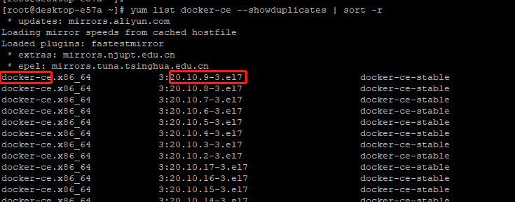

## 安装 Docker 和 Docker Compose 


### 一、安装规划
| 操作系统   | Docker版本|  Docker Compose 版本 |
| --------- | --------  | ---------- |
| Centos7.6 | docker-ce-20.10.9-3.el7 | v2.9.0 |

### 二、安装 Docker
> Tips: 如果不是以管理员账户执行的， 前面要加 sudo

#### 2.1 如果以前装过docker, 需要先卸载
```
  yum remove docker docker-common docker-selinux docker-engine
```

#### 2.2 安装需要的基础工具
```
# yum-util 提供yum-config-manager功能. 另两个是devicemapper驱动依赖

yum install -y yum-utils device-mapper-persistent-data lvm2
```

#### 2.3 设置yum源
```
# 中央仓库
yum-config-manager --add-repo http://download.docker.com/linux/centos/docker-ce.repo

# 阿里仓库
yum-config-manager --add-repo http://mirrors.aliyun.com/docker-ce/linux/centos/docker-ce.repo
```

#### 2.4 查看可用的docker版本
```
yum list docker-ce --showduplicates | sort -r
```


#### 2.5 安装Docker
```
# 安装最新稳定版
yum install docker-ce -y

# 或安装指定版本， 版本号是：上面俩红框用"-"连接
yum install docker-ce-20.10.9-3.el7 -y
```

#### 2.6 启动docker服务 & 设置开启启动
```
systemctl start docker
systemctl enable docker
```

#### 2.7 查看docker是否安装成功
```
docker --version
```


### 三、Docker Compose安装

#### 3.1 下载包
``` 
# 从github下载  
sudo curl -L "https://github.com/docker/compose/releases/download/v2.9.0/docker-compose-$(uname -s)-$(uname -m)" -o /usr/local/bin/docker-compose

# 从daocloud下载 (在国内，这儿更快)
sudo curl -L https://get.daocloud.io/docker/compose/releases/download/v2.9.0/docker-compose-`uname -s`-`uname -m` > /usr/local/bin/docker-compose
```

#### 3.2 给下载的包，添加执行权限
```
sudo chmod +x /usr/local/bin/docker-compose
```

#### 3.3 查看是否安装成功
```
dokcer-compose --version
```

### 四、步骤合集
```
## 一、安装Docker

# 卸载docker
yum remove docker docker-common docker-selinux docker-engine

# 安装基础工具
yum install -y yum-utils device-mapper-persistent-data lvm2

# 配置yum源
yum-config-manager --add-repo http://mirrors.aliyun.com/docker-ce/linux/centos/docker-ce.repo

# 安装docker
yum install docker-ce-20.10.9-3.el7 -y

# 启动并设置开机自启
systemctl start docker
systemctl enable docker

# 查看docker是否安装成功
docker --version

## 二、安装Docker Compose

# 下载包
sudo curl -L https://get.daocloud.io/docker/compose/releases/download/v2.9.0/docker-compose-`uname -s`-`uname -m` > /usr/local/bin/docker-compose

# 赋予执行权限
sudo chmod +x /usr/local/bin/docker-compose

# 测试是否安装成功
dokcer-compose --version
```