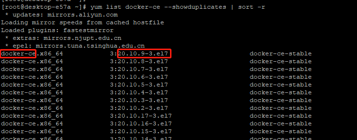

## 安装Docker


### 一、安装规划
| 操作系统   | Docker版本|
| --------- | --------  |
| Centos7.6 | docker-ce-20.10.9-3.el7 |

### 二、安装步骤
> Tips: 如果不是以管理员账户执行的， 前面要加 sudo

#### 1. 如果以前装过docker, 需要先卸载
```
  yum remove docker docker-common docker-selinux docker-engine
```

#### 2. 安装需要的基础工具
```
# yum-util 提供yum-config-manager功能. 另两个是devicemapper驱动依赖

yum install -y yum-utils device-mapper-persistent-data lvm2
```

#### 3. 设置yum源
```
# 中央仓库
yum-config-manager --add-repo http://download.docker.com/linux/centos/docker-ce.repo

# 阿里仓库
yum-config-manager --add-repo http://mirrors.aliyun.com/docker-ce/linux/centos/docker-ce.repo
```

#### 4. 查看可用的docker版本
```
yum list docker-ce --showduplicates | sort -r
```


#### 5. 安装Docker
```
# 安装最新稳定版
yum install docker-ce -y

# 或安装指定版本， 版本号是：上面俩红框用"-"连接
yum install docker-ce-20.10.9-3.el7 -y
```

#### 6.启动docker服务 & 设置开启启动
```
systemctl start docker
systemctl enable docker
```


### 三、步骤合集
```
# 卸载docker
yum remove docker docker-common docker-selinux docker-engine

# 安装基础工具
yum install -y yum-utils device-mapper-persistent-data lvm2

# 配置yum源
yum-config-manager --add-repo http://mirrors.aliyun.com/docker-ce/linux/centos/docker-ce.repo

# 安装docker
yum install docker-ce-20.10.9-3.el7 -y

# 启动并设置开机自启
systemctl start docker
systemctl enable docker
```