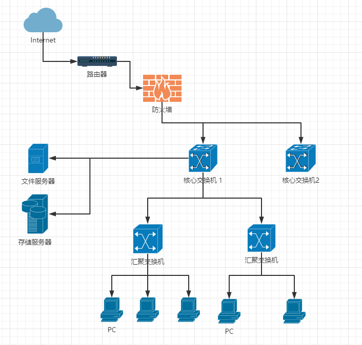
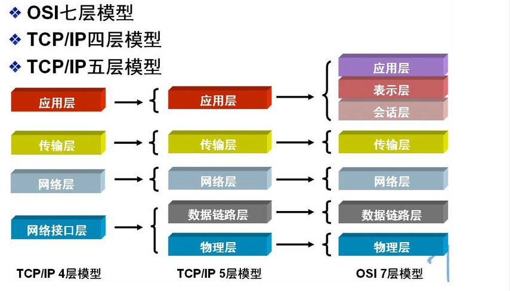

#### 网络拓扑图

&nbsp;

#### OSI七层模型 & TCP/IP五层模型 & TCP/IP四层模型

### 名词解释

* IP:
* Port:
* Router: 路由器
* Switch: 交换机
* Firewall: 防火墙
* NIC: 物理网卡
* SDN: 软件定义网络
* Security Group： 安全组
* Subnet: 子网
* VPC: 虚拟私有云
* CIDR: 无类别域间路由
* IPS:
* Vlan:
* POE:

### linux 虚拟网络

* TAP/TUN/VETH

* Linux Bridge

* Open vSwitch