文章内容来源：
> 1.《分布式服务架构原理、设计与实战》- 李艳鹏，杨彪  （文章结构和大多内容源自此处）

> 2.《架构即未来》  （AKF拆分原则来自此处）

参阅网页链接：

> 1.https://www.jianshu.com/p/92ca0bfbd52f （单体架构,SOA架构,微服务架构,分布式架构,集群架构)
>
> 2.https://blog.csdn.net/qq_42332821/article/details/103277262 
>
> 3.https://blog.csdn.net/weixin_40751299/article/details/83181582
>
> 4.http://blog.sina.com.cn/s/blog_493a84550102z8pw.html (单体到微服务划分大原则)

## 一、 传统单体架构
 *  定义：  一个应用中包含了应用程序所有的功能(比如：页面、代码、配置等)把应用程序打包成war包、jar包部署到服务器中，通常称之为单体架构。

### 单体架构图：

   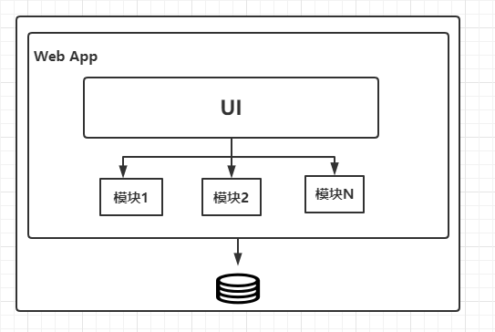
  
### 单体架构的演进：

  * 3.1  J2EE/JEE

  * 3.2  SSH

  * 3.3  从JEE到SSH的发展史：

     * 2000~2001年 Craig 觉得web层可以使用MVC框架使该层开发更加容易，于是就有了 Struts，这一步是对原来规范的很好实现，并没有产生质的突破；
     * 2001~2003年 Gavin 觉得EJB连接数据的部分有待改进，于是就有了Hibernate，Hibernate并没有被规范束缚，而是想怎么改就怎么改；                
     * 2002年左右 html + CSS + JS 也开始渐渐分离；
     * 2002~2004年 Rod 觉得类和类之间的依赖关系应该改善，于是就有了Spring，Spring是为了让 javaEE 规范更加易用，因此对其进行了大刀阔斧的改造。在当时看绝对是取其精华，去其糟粕。

### 单体架构优缺点分析：

  * 优点： 
    * 便于共享； 
    * 便于测试；
    * 便于部署；

  * 缺点： 
    * 复杂性高；
    * 技术债务逐渐上升；
    * 构建和部署速度逐渐变慢；
    * 扩展能力受限，无法按需伸缩；
    * 阻碍技术创新；

        

## 二、服务化架构（SOA）

### 2.1 定义：
   SOA代表面向服务的架构，俗称服务化。 SOA将应用程序的模块化组件通过定义明确的接口和契约联系起来， 接口是采用中立的方式进行定义的，独立于某种语言、硬件和操作系统，通常通过网络通信来完成，但
   不局限于某种网络协议，可以是底层的 TCP/IP , 可以是应用层的 HTTP, 可以是消息队列， 甚至可以是约定的某种数据库存储形式；

### 2.2 SOA 的两种主流实现方式：

   *  Web Service:

       *  工作原理图：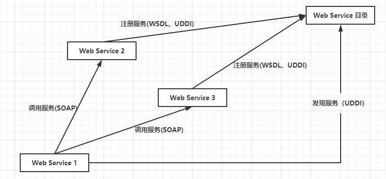
                           
       *  WebService三要素：
         *   WSDL 用来描述如何访问具体的接口； UDDI用来管理，分发，查询webService； SOAP用来描述传递信息的格式； 

             WSDL: （Web Services Description Language）是描述Web服务发布的XML格式。

             UDDI: （UniversalDescriptionDiscovery andIntegration）UDDI是一种用于描述、发现、集成Web Service的技术，它是Web Service协议栈的一个重要部分。通过UDDI，企业可以根据自己的需要动态查找并使用Web服务，也可以将自己的Web服务动态地发布到UDDI注册中心，供其他用户使用。

             SOAP: (Simple Object Access Protocol) 简单对象访问协议。SOAP使用基于XML的数据结构和超文本传输协议(HTTP)的组合定义了一个标准的方法来使用Internet上各种不同操作环境中的分布式对象。
         
         * 延申： SOAP 和 Rest 的对比

   *  ESB(总线型)：

       * 工作原理图：
       
       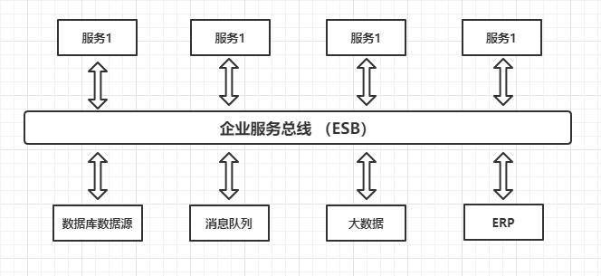

       * 说明：
         企业服务总线（Enterprise ServiceBus，ESB）是构建基于SOA解决方案时所使用基础架构的关键部分，是由中间件技术实现并支持SOA的一组基础架构功能。它是一种为进 行连接服务提供的标准化的通信基础结构。基于开放的标准，为应用提供了一个可靠的、可度量的和高度安全的环境，并可帮助企业对业务流程进行设计和模拟。对 每个业务流程实施控制和跟踪、分析并改进流程和性能。很多IT公司都推出了基于自己的平台工具的ESB产品，如IBM的WebSphere ESB、BEA的AqusLogic Service Bus等。除此之外，也出现了众多的开源ESB产品，如Mule、ServiceMix和Apache Synapse等。

       * 企业服务总线的功能和职责：
         *  监控和控制服务之间的消息路由；
         *  控制可插拔的服务化的功能和版本；
         *  解析服务之间交互和通信的内容和格式；
         *  通过组合服务、资源和消息处理来统一编排业务需要的信息处理流程；
         *  使用冗余来提供服务的备份能力；
         

### 2.3 服务化架构的优缺点分析：

   * SOA 特点分析：
   
       * SOA 定义了良好的对外接口， 通过网络协议对外提供服务， 服务之间表现为松耦合性， 松耦合性具有灵活的特点， 可以对服务流程进行灵活的组装和编排， 而不需要对服务本身做改变；
       * 组成整个业务流程的每个服务的内部结构和实现发生改变时， 不影响整个流程对外提供服务， 只要对外的接口保持不变， 则改变服务内部的实现机制对外部来说可以是透明的；
       * SOA的通信格式通常是XML, 但 XML标记定义在大规模和高并发通信过程中，冗余的标记会给性能带来极大的影响，渐渐被JSON取代；
       * SOA通过定义标准的对外接口， 可以让底层通用服务进行下沉， 共多个上层服务的使用方同时使用， 增加了服务的可重用性；
       * SOA可以让企业最大化地使用内部和外部的公共服务， 避免重复造轮子，例如： 通过SOA从外部获取时间服务；
   
   * SOA 缺点分析：

      * Web Service存在的问题：
     
        * 依赖中心化的服务发现机制；
        * 使用 SOAP 通信协议， 通常使用XML格式来序列化通信数据， XML格式的数据冗余太大，协议太重 。 （使用Rest替代）
        * 服务化管理和治理设施并不完善；
      
      * ESB存在的问题：
   
        * ESB虽然是SOA实现的一种方式， 却更多体现了系统集成的便利性， 通过统一的服务总线将服务组合在一起， 并提供组合的业务流程；
        * 组合在ESB上的服务本身可能是一个过重的整体服务， 或是传统的JEE服务；
        * ESB视图通过总线来隐藏系统内部的负责性， 但是系统内部的负责性仍然存在；
        * 对于总线本身的中心化管理模型， 系统变更影响的范围经常会随之扩大； 

## 三、微服务架构

###  微服务架构的产生：

###  对比：

   *  微服务架构与传统单体架构的对比：

   *  微服务架构与SOA服务化的对比：
   
        * 微服务架构的一些特点与SOA服务化架构相似， 事实上微服务架构与SOA服务化并不冲突， 而是一脉相承。 SOA服务化的理念在微服务架构中仍然有效， 微服务在SOA服务化的基础上进行了演进和叠加，形成了适合现代化场景的一个方法论。

        * 不同点：
        
            * 目的不同
                * SOA 服务化设计的范围更广一些， 强调不同的异构服务之间的协作和契约， 并强调有效集成、业务流程编排、历史应用集成等。 
                * 微服务的目的是有效地拆分应用，缩小变更和迭代的影响范围， 实现敏捷开发和部署，并达到单一微服务更容易水平扩展的的目的。
            * 服务粒度不同 
                * SOA 对粒度没有要求， 在实践中服务通常是粗粒度的，强调接口契约的规范化，内部的实现可以更粗粒度。
                * 微服务倡导将服务拆分成更细的粒度（但不是越细越好），通过多个服务组合来实现业务流程的处理，拆分到职责单一的服务。 
            * 部署方式不同
                * SOA服务化通常将多个服务通过组件化模块方式打包到一个War包， 然后统一部署在一个应用服务器上。（何为组件化模块方式打包）
                * 微服务将完整的应用拆分成多个细小的服务， 通常使用敏捷扩容、缩容的Docker技术来实现自动化的容器管理，每个微服务运行在单一的进程内，微服务中的部署互相独立、互不影响。
            

### 微服务的去中心化治理

  * 微服务倡导去中心化的治理， 不推荐每个微服务都使用相同的标准和技术来开发和使用服务。
     * eg: 使用Go开发一个服务，来对接java开发的另一个服务。  
      
  * 微服务倡导去中心化的管理和治理， 尽量不设置中心化的管理服务， 最差也需要在中心化的管理服务宕机时用替代方案和设计。
     * eg: 比如第一层SOA服务化采用Dubbo框架进行定制化， 如果Dubbo服务化出现大面积的崩溃，则服务化体系切换到点对点的hessian远程调用， 即服务化降级。 降级后的点对点hessian远程调用时没有中心化节点，整体上符合微服务原理。 
  

### 微服务的交互模式

   * 读者容错模式
       * 定义: 指微服务化中服务提供者和消费者之间如何对接口的改变进行容错。
          
       * 要求:  消费者需要对提供者提供的功能进行兼容性设计， 尤其对服务提供者返回的内容进行兼容，或者解决在服务提供者改变接口或者数据格式的情况下，如何让服务消费者正常运行；
                  
       * 案例：
           * 消费者处理服务提供者返回的内容时， 只提取自己需要的内容，抛弃其它内容；
           * 服务接口定义时， 参数可以使用枚举值， 返回值的DTO中禁止使用枚举值；
              
   * 消费者驱动契约模式：
        代表服务提供者向其当前消费者承诺遵守的约束。 一旦各消费者把自己的具体期望告知提供者， 则提供者无论在什么时间和场景下，都不应该打破契约。

   * 去数据共享模式
       * 微服务架构领域， 微服务间的交互通过定义良好的接口来实现，不要使用共享数据来实现。
       
       * 图解：
            
            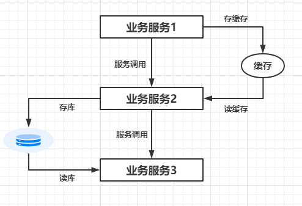
       
       * 缺点:
         * 使得微服务间交互除了依赖接口契约， 还依赖存储契约
         * 上游数据格式发生改变， 可能导致下游的处理逻辑出现问题
         * 多个服务共享一个资源服务， 导致对资源服务的运维难以划清责任和界限
         * 跨机房的服务调用不能使用独立的资源部署模式，难以实现服务自治

### 微服务的分解和组合模式
* 服务代理模式

    * 架构图：

        
        
    * 代理的职责      
        * 统一入口
        * 鉴权
        * 请求过滤
        
    * 案例      
        * CS API 服务网关
        * 新老系统切换
        

* 服务聚合模式

    * 架构图：

       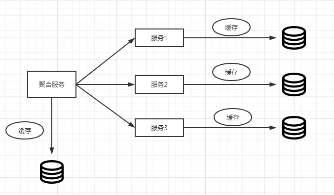
       
    * 案例
        * CS的聚合服务
        * 前台聚合 - 电商前台（商品服务+购物车服务+交易服务）
        * 后台聚合 - 交易服务（库存服务+支付服务+发票服务）

* 服务串联模式

    * 架构图：

        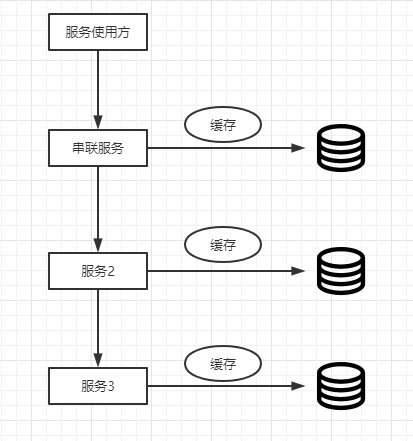
        
     * 原理及特点分析：
        
         这种模式在接收到请求后会产生一个经过合并的响应，在这种情况下，服务1接收到请求后会与服务B进行通信，类似地，服务2会同服务3进行通信。所有服务都使用同步消息传递。在整个链式调用完成之前，客户端会一直阻塞。因此，服务调用链不宜过长，以免客户端长时间等待
    
     * 案例
       * CS API网关 -> 纳管安超资源服务 -> 安超云网关 -> 安超服务 -> openstack服务
       * UI应用 -> 交易服务 -> 库存服务
 
 * 服务分支模式

      * 架构图

        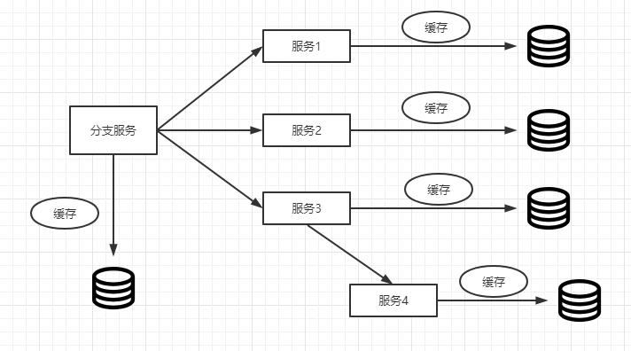

      * 案例
        * 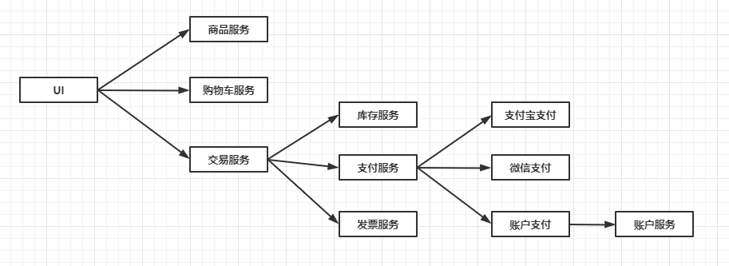

      * 特点分析：
         分支服务放大了服务的依赖关系， 在现实的微服务设计中尽量保持服务调用级别的简单，减少日后维护的工作量；

      * 使用分支模式对可用性的影响举例：

* 服务异步消息模式

    * 架构图

        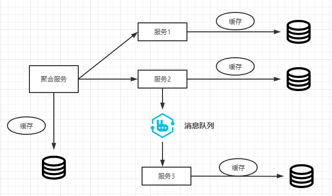
        
    * 分析:
        虽然REST设计模式非常流行，但它是同步的，会造成阻塞。因此部分基于微服务的架构可能会选择使用消息队列代替REST请求/响应, 尤其是对于非核心业务。
        
    * 案例
    
        * 订单支付后，发送短信/邮件；
        * 订单支付后，调用物流服务；
        
* 服务共享数据模式

    * 架构图
    
        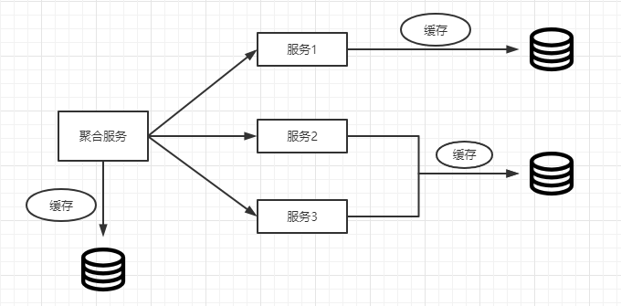
        
    * 分析：
        
    * 使用服务共享模式的场景：
    
       * 单元化架构
         有些平台对系统的性能要求非常高， 而微服务在通过网络服务进行通信时，即使有很高的带宽，还是会有性能方面的损耗，这样的场景可以让微服务间共享一些数据。 比如缓存、数据库等，
         甚至可以将缓存和数据与微服务部署在同一个物理机，最大限度的减少网络通信带来的性能损耗， 这种方法被称为"单元化架构"
       
       * 遗留的整体服务   
         在重构微服务的过程中， 有时单体服务依赖的数据库表耦合在一起， 若强行拆分会出现很多不符合规范的地方，而且可能会造成数据一致性的问题， 在没有完全把握的时候，会选择保持现状， 让不同的微服务暂时共享数据存储。 
&nbsp;
&nbsp;

### 微服务的容错模式

   *  舱壁隔离模式

       * 微服务容器分组

       * 线程池隔离

   * 熔断模式

        * 熔断模式的状态流转图：

           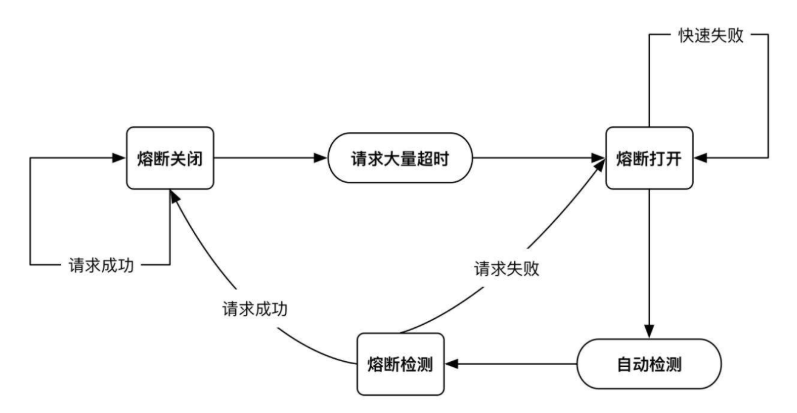

### 限流模式

   * 计数器

       * 原理： 通过原子变量计算单位时间内的访问次数， 如果超出某个阈值， 则拒绝后续的请求， 等到下一个时间单位再重新计数；
       * 实例分析：

   * 令牌桶

        * 原理： 通过一个线程在单位时间内产生固定数量的令牌， 然后把令牌放入队列， 每次请求调用需要从桶中拿取一个令牌， 拿到令牌后才有资格执行请求调用， 否则只能等待拿到令牌再执行，或者直接丢弃；
                   
   * 信号量

        * 原理： 类似于java中的 Semaphore

### 失效转移模式

   * 若微服务架构中发生了熔断和限流， 该如何处理被拒绝的请求？ 解决这个问题的模式叫做失效转移模式， 通常分为下面几种：

      * 快速失败策略， 即直接返回错误给调用方；

      * 如果有备份，则迅速切换到备份服务；

      * 重试机制；

### 微服务的粒度 
   * 微服务的拆分不是越细越好。 倡导对微服务的拆分适可而止，原则是拆分到可以让使用方自由地编排底层的子服务来获得相应的组合服务即可，同时要考虑团队的建设及人员的数量和分配等。

## 四、服务化管理和治理框架的技术选型
      
   * RPC

   * 服务化

   * 微服务
   

   

   