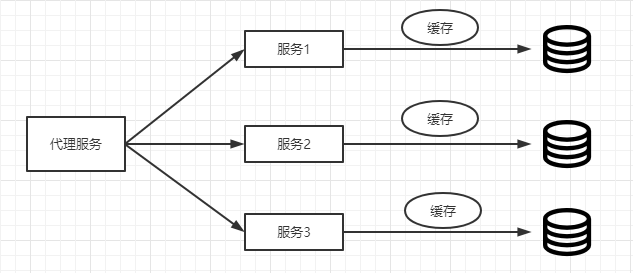

注：本篇内容大多来源 《分布式服务架构原理、设计与实战》 - 李艳鹏，杨彪 著， 另外结合网上查阅资料进行补充，再加上个人理解而成。
    

未完待续。。。

一、 传统单体架构
 *  定义：  一个应用中包含了应用程序所有的功能(比如：页面、代码、配置等)把应用程序打包成war包、jar包部署到服务器中，通常称之为单体架构。

 * 单体架构图：

     
  
 * 单体架构的演进：

    * 3.1  J2EE/JEE

    * 3.2  SSH

    * 3.3  从JEE到SSH的发展史：

       * 2000~2001年 Craig 觉得web层可以使用MVC框架使该层开发更加容易，于是就有了 Struts，这一步是对原来规范的很好实现，并没有产生质的突破；
       * 2001~2003年 Gavin 觉得EJB连接数据的部分有待改进，于是就有了Hibernate，Hibernate并没有被规范束缚，而是想怎么改就怎么改；                
       * 2002年左右 html + CSS + JS 也开始渐渐分离；
       * 2002~2004年 Rod 觉得类和类之间的依赖关系应该改善，于是就有了Spring，Spring是为了让 javaEE 规范更加易用，因此对其进行了大刀阔斧的改造。在当时看绝对是取其精华，去其糟粕。

 * 单体架构优缺点分析：

    * 优点： 1.便于共享； 2.便于测试； 3.便于部署；

    * 缺点： 1.复杂性高； 2.技术债务逐渐上升； 3.构建和部署速度逐渐变慢； 4.扩展能力受限，无法按需伸缩； 5.阻碍技术创新；

        

二、服务化架构（SOA）

   *  定义：

   *  SOA 的实现方式：

        *  Web Service:

            *  工作原理图：
                           
            *  涉及到的技术说明及原理：

                  WSDL:

                  UDDI:

                  SOAP:

            *  进一步演进出来了技术形态：

                  Rest + Http + Json

        *  ESB：

            * 工作原理图：工作原理图：

            *  设计到的技术说明及原理：

        *  服务化架构的优缺点分析：

三、微服务架构

   *  微服务架构的产生：

   *  对比：

      *  微服务架构与传统单体架构的对比：

      *  微服务架构与SOA服务化的对比：

   * 微服务的去中心化治理

   * 微服务的交互模式

      * 读者容错模式

      * 消费者驱动模式

      * 去数据共享模式

   * 微服务的分解和组合模式

      * 服务代理模式

         * 原理及特点分析：

         * 架构图：

         * 

      * 服务聚合模式

         * 原理及特点分析：

         * 架构图：

         * 

      * 服务串联模式

         * 原理及特点分析：

         * 架构图：

         * 
 
      * 服务分支模式

         * 原理及特点分析：

         * 架构图

         * 

         * 使用分支模式对可用性的影响举例：

      * 服务异步消息模式

         * 原理及特点分析：

         * 架构图

         * 

      * 服务共享数据模式

         * 原理及特点分析：

         * 架构图

         * 

   * 微服务的容错模式

        *  舱壁隔离模式

            * 微服务容器分组

            * 线程池隔离

        * 熔断模式

             * 熔断模式的状态流转图：

                

        * 限流模式

             * 计数器

                 * 原理： 通过原子变量计算单位时间内的访问次数， 如果超出某个阈值， 则拒绝后续的请求， 等到下一个时间单位再重新计数；
                 * 实例分析：

             * 令牌桶

                  * 原理： 通过一个线程在单位时间内产生固定数量的令牌， 然后把令牌放入队列， 每次请求调用需要从桶中拿取一个令牌， 拿到令牌后才有资格执行请求调用， 否则只能等待拿到令牌再执行，或者直接丢弃；
                   
             * 信号量

                  * 原理： 类似于java中的 Semaphore

   * 失效转移模式

      * 若微服务架构中发生了熔断和限流， 该如何处理被拒绝的请求？ 解决这个问题的模式叫做失效转移模式， 通常分为下面几种：

         * 快速失败策略， 即直接返回给调用方错误；

         * 是否由备份， 如果有，则迅速切换到备份服务；

         *  重试机制；

* 微服务的粒度 

四、服务化管理和治理框架的技术选型
      
   * RPC

   * 服务化

   * 微服务
   

另附参阅网页链接：

 > https://www.jianshu.com/p/92ca0bfbd52f （单体架构,SOA架构,微服务架构,分布式架构,集群架构）

   