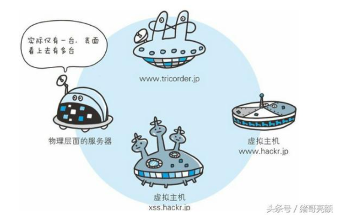
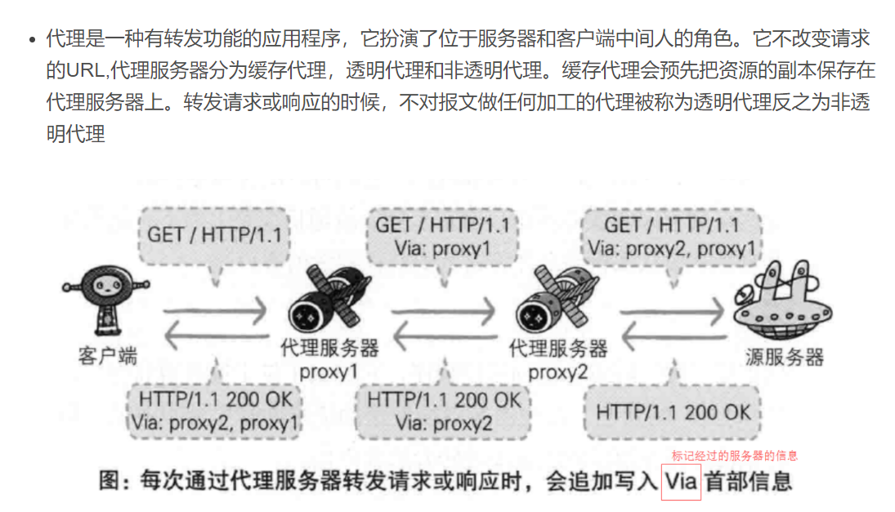
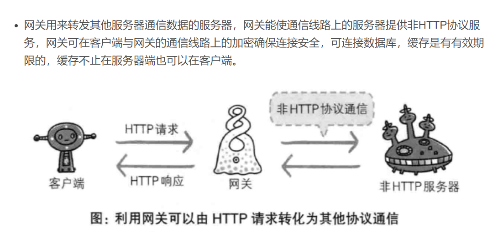
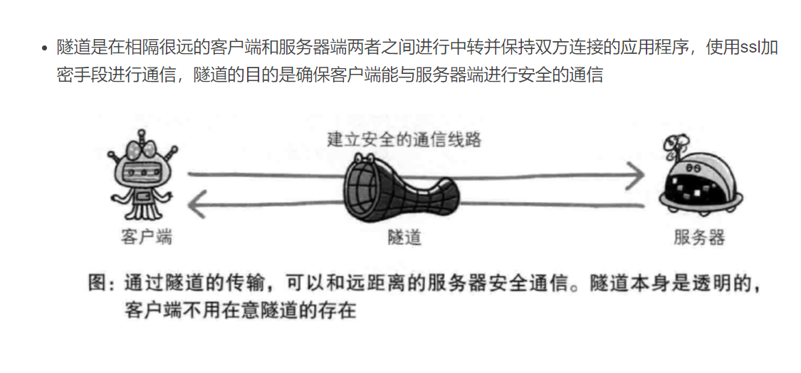

# HTTP请求的传输

## 1. HTTP在OSI七层模型中的位置

## 2. HTTP通信传输图

## 3. HTTP协议和其它协议的关系

## 4.单台服务器实现多个域名
HTTP/1.1 规范允许一台HTTP服务器搭建多个Web站点，如下图：即使只有一台物理机，也可以通过虚拟化技术实现部署多个服务

>比如， 客户端请求地址是：http://www.tricorder.jp， 通过DNS(域名解析)，可以将 www.tricorder.jp 映射到一个IP地址上； 再通过ARP协议(地址解析协议)，
获得这个IP地址对应的Mac地址, 最终找到了这台物理机。 可这台物理机上部署了好几个服务，具体该找谁呢？ 此时就必须在header:Host里完整指定主机名或者域名的URI. 

## 5.通信数据转发程序: 代理、网关、隧道
> HTTP通信时，除了客户端和服务器外，还有一些用于通信数据转发的应用程序，比如代理、网关和隧道。它们可以配合服务器工作。

### 代理
> 代理是一种有转发功能的应用程序，它扮演了位于服务器和客户端“中间人”的角色， 接收客户端的请求并转发给服务器，同时也接收服务器返回的响应转发给客户端。

### 网关
> 网关是转发其它服务器通信数据的服务器， 接收从客户端发来的请求时，它就像自己拥有资源的源服务器一样对请求进行处理。 有时客户端可能都不会察觉，自己的通信目标是一个网关。

### 隧道
> 隧道是在相隔甚远的客户端和服务器两者之间进行中转， 并保持双方通信连接的应用程序。

