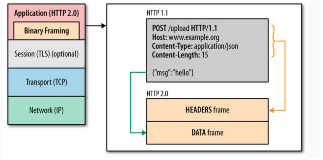
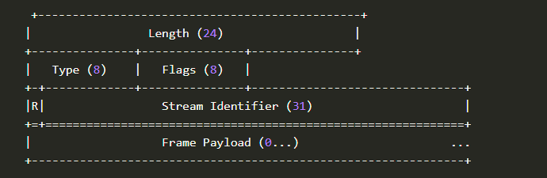
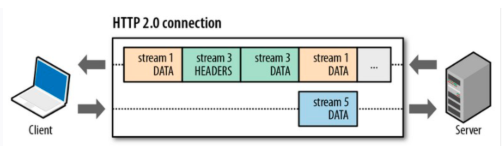

# HTTP版本演进 

**注：**
> 本文内容需配合思维导图（HTTP版本演进）使用，用于解释其中的一些知识点。 思维导图链接： https://www.processon.com/mindmap/61385545e401fd1fb6b22909 

**参考文档:**
> 1. 《图解HTTP》 
> 2. https://cloud.tencent.com/developer/article/1464938 (详解HTTP/1.0、HTTP/1.1、HTTP/2、HTTPS)
> 3. https://baike.baidu.com/item/http/243074 (百度百科)
> 4. https://zhuanlan.zhihu.com/p/86426969 (TCP连接三次握手四次挥手)
> 5. https://blog.csdn.net/shouwang666666/article/details/70232053 （HTTP请求/响应报文结构）
> 6. https://cloud.tencent.com/developer/section/1190064 （RFC 2616:HTTP/1.1）
> 7. https://baijiahao.baidu.com/s?id=1626599028653203490&wfr=spider&for=pc(GET和POST的区别详细解说)
> 8. https://segmentfault.com/a/1190000002601640 (http2 - stream)
> 9. https://halfrost.com/http2-http-frames/ (HTTP/2中的HTTP帧和流的多路复用)

## 一、 发展史
> 1. HTTP/0.9：1991年发布，极其简单，只有一个get命令
> 2. HTTP/1.0：1996年5月发布，增加了大量内容
> 3. HTTP/1.1：1997年1月发布，进一步完善HTTP协议，是目前最流行的版本
> 4. SPDY ：2009年谷歌发布SPDY协议，主要解决HTTP/1.1效率不高的问题
> 5. HTTP/2 ：2015年借鉴SPDY的HTTP/2发布, 谷歌宣布放弃SPDY, 转而支持HTTP/2

## 二、 HTTP/0.9

  HTTP协议的最初版本，功能简陋，仅支持请求方式GET。 是一个交换信息的无序协议，仅仅限于文字。由于无法进行内容的协商，在双发的握手和协议中，并有规定双发的内容是什么，也就是图片是无法显示和处理的。

## 三、 HTTP/1.0

#### 1. 增加内容

 *  请求和响应支持Header，用来描述一些元数据.
 *  请求方式除了GET外，增加了请求方式POST和HEAD
 *  响应的数据格式**Content-Type**: 告诉客户端实际返回的内容的内容类型,  支持多种格式， 比如 text/html、image/jpeg等
 *  状态码(status code)
 *  多字符集支持
 *  权限(authorization)
 *  缓存(cache) 
 *  内容编码(content encoding）
 *  ...........

#### 2. 部分内容介绍
* **内容编码(Content Encoding)**
```
介绍：

1. 网站服务器生成原始响应报文，其中有原始的 Content-Type 和 Content-Length 首部。
2. 内容编码服务器（也可能就是原始的服务器或下行的代理）创建编码后的报文，编码后的报文有同样的 Content-Type 但 Content-Length 可能不同（比如主体被压缩了）。内容编码服务器在编码后的报文中增加 Content-Encoding 首部，这样接收的应用程序就可以进行解码了。
3. 接收程序得到编码的报文，进行解码，获得原始报文。
```
常用编码：

| 编码      | 描述 |
|------    |--------|
| gzip     | 表明实体采用 GNU zip 编码  |
| compress | 表明实体采用 Unix 的文件压缩程序 |
| deflate  | 表明实体采用 zlib 的格式压缩 |
| identity | 表明没有对实体进行编码。当没有 Content-Encoding 首部是，就默认为这种情况 |
> gzip、compress 以及 deflate 编码都是无损压缩算法，用于减少传输报文的大小，不会导致信息损失。这些算法中，gzip 通常是效率最高的，使用最为广泛。

#### 2 缺陷 
客户端和服务端只保持短暂的连接，客户端每次请求都需要与服务端建立一个TCP连接。（TCP连接的新建成本很高，因为需要客户端和服务端三次握手），
服务器完成请求处理后立即断开TCP连接，服务器不跟踪每个客户也不记录过去的请求

## 三、HTTP/1.1
#### 1 增加内容：

#### 2 部分内容介绍：

 * **长连接(Persistent Connection)**：</br>
   ```
   介绍：
   
   允许HTTP设备在事务处理结束之后将TCP连接保持在打开的状态，以便未来的HTTP请求重用现在的连接，直到客户端或服务器端决定将其关闭为止。
   在HTTP1.0中使用长连接需要添加请求头 Connection: Keep-Alive，而在HTTP 1.1 所有的连接默认都是长连接，除非特殊声明不支持(HTTP请求报文首部加上Connection: close)
   ```
   
   
* **分块编码传输(Chunked transfer encoding):**
  ```
  介绍：
  
  通常HTTP应答消息中发送的数据是整个发送的，Content-Length消息头字段表示数据的长度。数据的长度很重要，因为客户端需要知道哪里是应答消息的结束，以及后续应答消息的开始。然而，使用分块传输编码，数据分解成一系列数据块，并以一个或多个块发送，这样服务器可以发送数据而不需要预先知道发送内容的总大小。通常数据块的大小是一致的，但也不总是这种情况。
  ```
  
  ```
  优点：
  
  1.分块传输编码允许服务器在最后发送消息头字段。对于那些头字段值在内容被生成之前无法知道的情形非常重要，例如消息的内容要使用散列进行签名，散列的结果通过HTTP消息头字段进行传输。
  没有分块传输编码时，服务器必须缓冲内容直到完成后计算头字段的值并在发送内容前发送这些头字段的值。
  
  2.HTTP服务器有时使用压缩 （gzip或deflate）以缩短传输花费的时间。分块传输编码可以用来分隔压缩对象的多个部分。在这种情况下，块不是分别压缩的，而是整个负载进行压缩，压缩的输出使用本文描述的方案进行分块传输。在压缩的情形中，分块编码有利于一边进行压缩一边发送数据，而不是先完成压缩过程以得知压缩后数据的大小。

  ```
  
* **字节范围请求：** 
  ```
  介绍：
  
  HTTP1.1支持传送内容的一部分。比方说，当客户端已经有内容的一部分，为了节省带宽，可以只向服务器请求一部分。该功能通过在请求消息中引入了range头域来实现，它允许只请求资源的某个部分。
  在响应消息中Content-Range头域声明了返回的这部分对象的偏移值和长度。如果服务器相应地返回了对象所请求范围的内容，则响应码206（Partial Content）
  ```

* **Pipeline:** 
  ```
   介绍：
  
   即在同一个TCP连接中，客户端可以同时发送多个请求
  ```

* **请求消息和响应消息都支持Host头域：** 
  ```
  介绍：
  
  在 HTTP/1.0 中认为每台服务器都绑定一个唯一的IP地址，因此，请求消息中的URL并没有传递主机名（hostname）。
  但随着虚拟主机技术的发展，在一台物理服务器上可以存在多个虚拟主机（Multi-homed Web Servers），并且它们共享一个IP地址。
  ```

* **缓存处理：** 
  ```
  介绍：
  
  HTTP/1.1在1.0的基础上加入了一些cache的新特性，引入了实体标签，一般被称为e-tags，新增更为强大的Cache-Control头。
  ```

* **新增请求方法：** 
  ```
  介绍：
  
  HTTP1.1增加了OPTIONS, PUT, DELETE, TRACE, CONNECT方法;
  ```
  
  

#### 2. 缺点
* **使用Pipeline方式带来队头阻塞问题(Head-of-line blocking)：**
  ```
  HTTP/1.1 的持久连接和管道机制允许复用TCP连接，在一个TCP连接中，也可以同时发送多个请求，但是所有的数据通信都是按次序完成的，服务器只有处理完一个回应，才会处理下一个回应。
  比如客户端需要A、B两个资源，管道机制允许浏览器同时发出A请求和B请求，但服务器还是按照顺序，先回应A请求，完成后再回应B请求，这样如果前面的回应特别慢，后面就会有很多请求排队等着，这称为"队头阻塞(Head-of-line blocking)"
  ```


## 四、SPDY 
2009年谷歌发布SPDY协议，主要解决HTTP/1.1效率不高的问题

## 五、HTTP/2.0
> HTTP/2.0 主要是对上个版本HTTP/1.1的性能优化

#### 1. 增加内容
* 二进制分帧
* 多路复用
* 头部压缩
* 流量控制
* 请求优先级
* 服务端推送
* 。。。


#### 2.部分内容解释 

* **二进制分帧（Binary Framing）** 

```
   1. 在加密协议层之上， 增加了一个二进制分帧层；
   2. 把一个请求的Header数据和Data数据, 切分成多个帧（frame）, 且数据转成二进制形式(以前是ASCII), 以帧为最小的数据传输单位。 
```

##### 二进制分帧层 和 header&data frame


##### 帧的结构


* **多路复用 (Multiplexing)**

```
 1. 客户端和服务端的单个域(domain)之间， 只建立一个TCP连接， 所有的frame传输，都通过这个一个连接传输；
 2. 每个帧的结构里，都有一个 Stream Identifier字段，标识着属于哪个流(Stream). Stream为一组共享同一StreamID的Frame集合, 是一个独立的，客户端和服务端在HTTP/2连接下交换帧的双向序列集;
 3. 不同请求的帧，在传输时是无序的， 但在流上发送帧的顺序非常重要。 接收方按照收到的顺序处理帧。特别是，HEADERS 和 DATA 帧的顺序在语义上是重要的.
```




* **头部压缩（Header Compression）**

```
HTTP 协议不带有状态，每次请求都必须附上所有信息。所以，请求的很多字段都是重复的，，一模一样的内容，每次请求都必须附带，这会浪费很多带宽，也影响速度。
HTTP/2 对这一点做了优化，引入了头信息压缩机制（header compression）。一方面，头信息压缩后再发送（SPDY 使用的是通用的DEFLATE 算法，而 HTTP/2 则使用了专门为首部压缩而设计的 HPACK 算法）。
另一方面，客户端和服务器同时维护一张头信息表，所有字段都会存入这个表，生成一个索引号，以后就不发送同样字段了，只发送索引号，这样就提高速度了。

实现方式较繁琐，自己看吧： https://halfrost.com/http2-header-compression/
```


* **服务端推送（Server Push）**
> HTTP/2 允许服务器未经请求，主动向客户端发送资源，这叫做服务器推送（server push）, 客户端也有权选择是否接收。
```
常见场景是客户端请求一个网页，这个网页里面包含很多静态资源。正常情况下，客户端必须收到网页后，解析HTML源码，发现有静态资源，再发出静态资源请求。
其实，服务器可以预期到客户端请求网页后，很可能会再请求静态资源，所以就主动把这些静态资源随着网页一起发给客户端了。  
```


## 六、HTTP/3.0

暂未推出正式版


