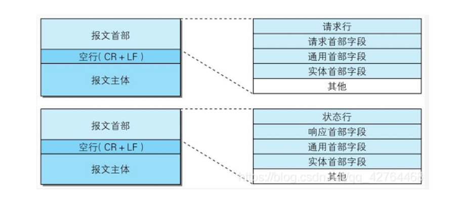

# HTTP报文的构成
> 以 HTTP/1.1 为基础

### 1. Request报文的构成
#### 一个HTTP请求报文由四个部分组成：**请求行**、**请求头**、**空行(CR+LF)**、**请求数据**

**请求行**
> 由请求方法字段、URL字段和HTTP协议版本字段3个字段组成:

**请求头**
> 由 请求头部字段 + 通用头部字段 + 实体首部字段 组成;

**空行**
   > CR+LF : 用于隔离请求头和请求实体

**请求实体**

### 2. Response报文的构成
##### 一个HTTP响应报文由四部分组成：**状态行**、**响应头**、**空行(CR+LF)**、**响应实体**

1. 状态行
   >  HTTP版本 + 状态码
2. 响应头
   > 由 响应头部字段 + 通用头部字段 + 实体首部字段 组成;
3. 空行
   > CR+LF : 用于隔离响应头和响应实体
4. 响应实体

### 3. 请求头 （比较重要）
> Http Header有四种： **通用header**、**请求header**、**响应header**、**实体header**

#### 3.1 通用首部

|    名称              |     含义               |
| ------------------- | ---------------------- |
|   Cache-Control     |  控制缓存的行为           |
|   Connection        |  逐跳首部、连接的管理      |
|   Date              |  创建报文的时间           |
|   Pragma            |  报文指令                |
|   Trailer           |  报文末端的首部一览        |
|   Transfer-Encoding |  指定报文主体的传输编码方式 |
|   Upgrade           |  升级为其它协议           |
|   Via               |  代理服务器的相关信息      |
|   Warning           |  错误通知                |

Cache-Control

#### 3.2 请求首部

|    名称                 |      含义     |
| ---------------------- | -----------   |
|    Accept              |               |
|    Accept-Charset      |               |
|    Accept-Encoding     |               |
|    Accept-Language     |               |
|    Authorization       |               |
|    Except              |               |
|    From                |               |
|    Host                |               |
|    If-Match            |               |
|    If-Modified-Since   |               |
|    If-None-Match       |               |
|    If-Range            |               |
|    If-Unmodified-Since |               |
|    Max-Forwards        |               |
|    Proxy-Authorization |               |
|    Range               |               |
|    Referer             |               |
|    TE                  |               |
|    User-Agent          |               |

#### 3.3 响应首部

|    名称                 |      含义     |
| ---------------------- | -----------   |
|    Accept-Ranges       |   |
|    Age                 |   |
|    ETag                |   |
|    Location            |   |
|    Proxy-Authenticate  |   |
|    Retry-After         |   |
|    Server              |   |
|    Vary                |   |
|    WWW-Authenticate    |   |

#### 3.4 实体首部

|    名称                 |      含义     |
| ---------------------- | -----------   |
|    Allow               |  |
|    Content-Encoding    |  |
|    Content-Language    |  |
|    Content-Length      |  |
|    Content-Location    |  |
|    Content-Md5         |  |
|    Content-Range       |  |
|    Content-Type        |  |
|    Expires             |  |
|    Last-Modified       |  |

### 4. 请求方法

|    名称          | 引入版本   |   含义                      |
| ----------------| --------- |--------------------------- |
| GET             |  HTTP/0.9 | 查询资源，类比SQL Select      |
| POST            |  HTTP/1.0 | |
| HEAD            |  HTTP/1.0 | Response只返回Head,不返回body |
| PUT             |  HTTP/1.1 | 更新全部资源，类比SQL Update 方法  |
| PATCH           |  HTTP/1.1 | 更新部分资源，如果资源不存在，  |
| DELETE          |  HTTP/1.1 | |
| OPTIONS         |  HTTP/1.1 | |
| TRACE           |  HTTP/1.1 | |
| CONNECT         |  HTTP/1.1 | |
注: 协议规范是一回事儿， 容器有没有实现协议规范是另一回事儿， 具体要以实际情况为准。

### 5、响应状态码
|        |  类别          | 原因                 |
| ------ | ------        | ------               |
| 1XX    | 信息性状态码    | 请求正在处理            |
| 2XX    | 成功状态码      | 请求正常处理完毕        |
| 3XX    | 重定向状态码    | 需要进行附加操作来完成请求 |
| 4XX    | 客户端错误状态码 | 服务器无法处理请求       |
| 5XX    | 服务器错误状态码 | 服务器处理请求出错       |

