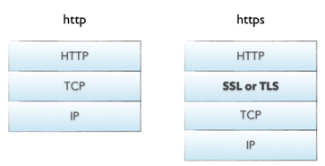

## HTTPS （HTTP over SSL）

https://blog.csdn.net/u011779724/article/details/80776776 HTTPS的建立过程
> HTTPS =  HTTP + 加密 + 认证 + 完整性保护

> SSL（Secure Socket Layer，安全套接字层）：1994年为 Netscape 所研发，SSL 协议位于 TCP/IP 协议与各种应用层协议之间，为数据通讯提供安全支持。

>TLS（Transport Layer Security，传输层安全）：其前身是 SSL，它最初的几个版本（SSL 1.0、SSL 2.0、SSL 3.0）由网景公司开发，
1999年从 3.1 开始被 IETF 标准化并改名，发展至今已经有 TLS 1.0、TLS 1.1、TLS 1.2 三个版本。SSL3.0和TLS1.0由于存在安全漏洞，已经很少被使用到。TLS 1.3 改动会比较大，目前还在草案阶段，目前使用最广泛的是TLS 1.1、TLS 1.2。

### HTTP向HTTPS的演进

#### HTTP 缺点
1. 通信使用明文（不加密）, 内容可能会被窃听；
2. 不验证通信方的身份，因此可能遭遇伪装；
3. 无法证明报文的完整性，所以报文有可能已被篡改；

###  

