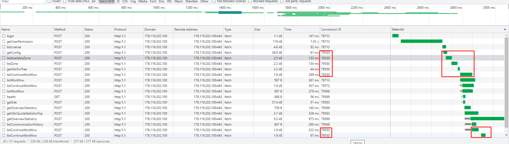
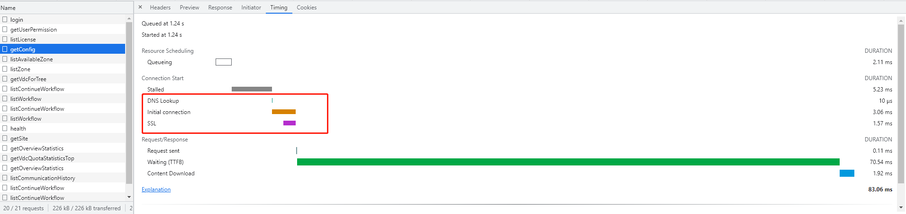

# HTTP连接

> 参考文章:
> 
> https://blog.csdn.net/zgpeace/article/details/104981860(HTTP的短连接、长连接、管道连接流水线) 
> https://blog.csdn.net/fesfsefgs/article/details/108294050(HTTP详解长短连接，管道化，队头阻塞及它们之间的关系)

##  一、非管道化
> 特点：请求和响应都是有序的，要等上一次请求响应后，才开始下一个请求。

### 1.1 短连接

> HTTP1.0时候默认使用的连接方式，每个HTTP请求，都须建立一个TCP连接。

#### 缺点：
> 每次都要建立一个TCP连接. 经历3次握手，数据传输，4次挥手。 既耗时，也耗资源。 在当前普遍一个页面需要数个请求才能获取全部数据的场景，短板很明显。 

 

### 1.2 长连接
> 多个HTTP请求可以使用一个TCP连接。 
> 比如浏览器中的请求，有Connection ID字段， 相同的ID代表使用的是同一个TCP连接。 且从Waterfall里可以看出，必须等到上一个请求结束, 才能开始下一个请求。

> 另外，从Timing页可以看出，建立连接的步骤和耗时

#### 缺点：
> 必须等到上一个请求结束, 才能开始下一个请求

## 二、管道化(Pipelining)
> 多个HTTP请求可以使用一个TCP连接，不需要收到上一个请求的Response，就能发起下一个请求.
> HTTP管道化要求服务端必须按照请求发送的顺序返回响应

#### 缺点
> 头部阻塞(HOL), 由于HTTP管道化要求服务端必须按照请求发送的顺序返回响应， 当某个响应耗时较长， 后面的响应数据即使已经准备好了，也不能提前返回给请求方。
> 幂等： 并不是所有类型的 HTTP 请求都能使用管道化，只有幂等性方式，比如 GET、HEAD、PUT 和 DELETE 能够被安全的重试。

### 三、解决管道化带来的HTTP队头阻塞（HOL）的问题
> TCP由于本身实现机制也有队头阻塞问题， 除非舍弃使用TCP协议，比如HTTP/3.0， 否则在应用层无法解决

#### 3.1 并发TCP连接

#### 3.2 域名分片

#### 3.3 多路复用（HTTP2.0）