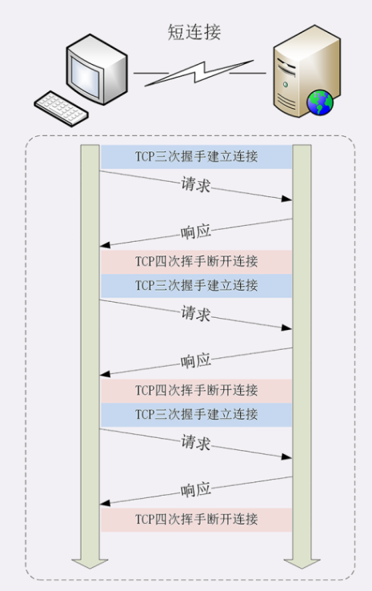
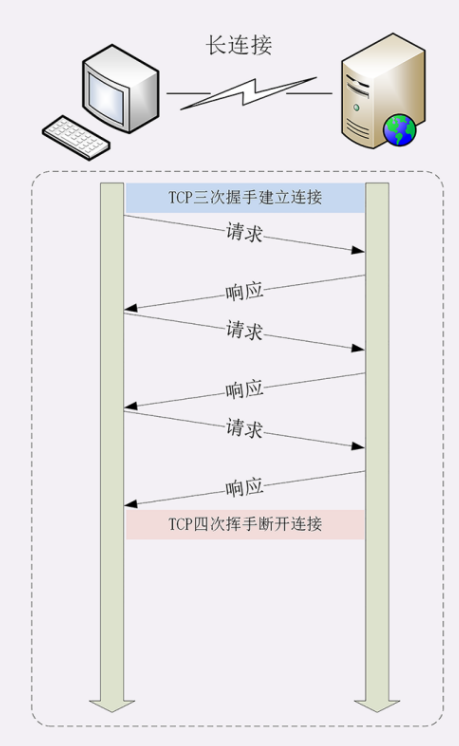
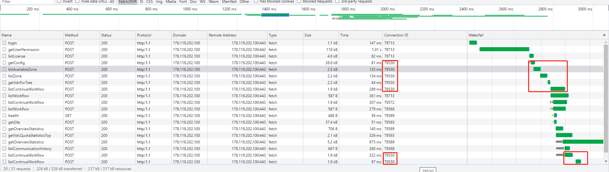
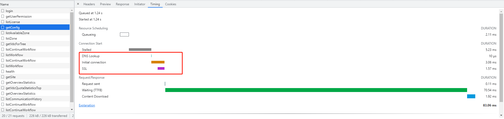
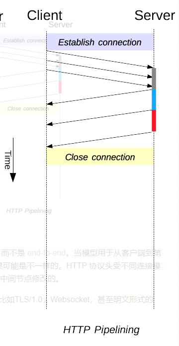
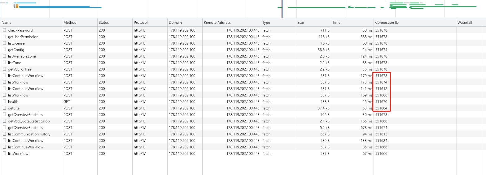

# HTTP连接

> 参考文章:
> 
> https://blog.csdn.net/zgpeace/article/details/104981860(HTTP的短连接、长连接、管道连接流水线) 
> https://blog.csdn.net/fesfsefgs/article/details/108294050(HTTP详解长短连接，管道化，队头阻塞及它们之间的关系)
> https://blog.csdn.net/weixin_41593408/article/details/98701519?utm_term=http%E5%9F%9F%E5%90%8D%E5%88%86%E7%89%87&utm_medium=distribute.pc_aggpage_search_result.none-task-blog-2~all~sobaiduweb~default-0-98701519&spm=3001.4430 (HTTP | 性能优化)


##  一、非管道化
> 特点：请求和响应都是有序的，要等上一次请求响应后，才开始下一个请求。

### 1.1 短连接

> HTTP1.0时候默认使用的连接方式，每个HTTP请求，都须建立一个TCP连接。

#### 缺点：
> 每次都要建立一个TCP连接. 经历3次握手，数据传输，4次挥手。 既耗时，也耗资源。 在当前普遍一个页面需要数个请求才能获取全部数据的场景，短板很明显。 

 

### 1.2 长连接
> 多个HTTP请求可以使用一个TCP连接。 
> 比如浏览器中的请求，有Connection ID字段， 相同的ID代表使用的是同一个TCP连接。 且从Waterfall里可以看出，必须等到上一个请求结束, 才能开始下一个请求。



> 另外，从Timing页可以看出，建立连接的步骤和耗时



#### 缺点：
> 必须等到上一个请求结束, 才能开始下一个请求

## 二、管道化(Pipelining)
> 多个HTTP请求可以使用一个TCP连接，不需要收到上一个请求的Response，就能发起下一个请求.
> HTTP管道化要求服务端必须按照请求发送的顺序返回响应




#### 缺点
> 头部阻塞(HOL), 由于HTTP管道化要求服务端必须按照请求发送的顺序返回响应， 当某个响应耗时较长， 后面的响应数据即使已经准备好了，也不能提前返回给请求方。
> 幂等： 并不是所有类型的 HTTP 请求都能使用管道化，只有幂等性方式，比如 GET、HEAD、PUT 和 DELETE 能够被安全的重试。

## 三、HTTP 性能优化
> TCP由于本身实现机制也有队头阻塞问题， 除非舍弃使用TCP协议，比如HTTP/3.0， 否则在应用层无法解决

### HTTP/1.X 优化

#### 1. 并发TCP连接
> 同时对一个域名发起多个长连接，用数量来解决问题. 但如果每个客户端都想自己快，建立很多个连接，用户数×并发数就会是个天文数字。服务器的资源根本就扛不住，或者被服务器认为是恶意攻击，反而会造成“拒绝服务”。 
> 所以，HTTP 协议建议客户端使用并发，但不能“滥用”并发。RFC2616 里明确限制每个客户端最多并发 2 个连接。不过实践证明这个数字实在是太小了，众多浏览器都“无视”标准，把这个上限提高到了 6~8。
> 后来修订的 RFC7230 也就“顺水推舟”，取消了这个“2”的限制。 比如现在：Chrome, Firefox是 6 



#### 2. 域名分片（Domain Sharding）
> 由于上一点中浏览器对单个域名有最大TCP连接数限制，此方法基于此再做优化， 为了可以同时下载超过该限制数的资源，域名分片（domain sharding）会将内容拆分到多个子域中。当使用多个域来处理多个资源时，浏览器能够同时下载更多资源，从而缩短了页面加载时间并改善了用户体验。
> 就性能而言，域名分片的问题在于每个域都需要额外的 DNS 查找成本, 以及建立每个 TCP 连接的开销。

```
比如网站首页加载内容太多， 可以考虑把资源放在不同的域名下：
data.domainX.com
img.domainX.com
audit.domainX.com
```

### 3.3 多路复用（HTTP2.0）