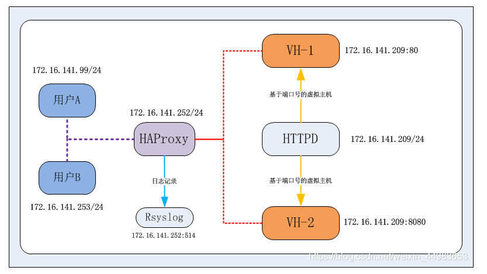

# HaProxy 配置详解

## 参考文章
> https://www.cnblogs.com/lgj8/p/14765044.html

## 配置详解
* HaProxy 的配置文件由两部分组成：**全局设定** && **代理设定**
* 全局配置为： **global**
* 代理配置为： **defaults** && **frontend** && **backend** && **listen**

### 全局配置(global)
* 全局配置主要用于设定义全局参数，属于进程级的配置，通常和操作系统配置有关

### 代理配置

#### default
* 配置默认参数，这些参数可以被用到frontend，backend，Listen组件
> Tips: 在此部分中设置的参数值，默认会自动引用到下面的frontend、backend、listen部分中，因引，某些参数属于公用的配置，只需要在defaults部分添加一次即可。而如果frontend、backend、listen部分也配置了与defaults部分一样的参数，Defaults部分参数对应的值自动被覆盖。

#### frontend
* 接收请求的前端虚拟节点，Frontend可以更加规则直接指定具体使用后端的backend
> Tips: frontend是在haproxy 1.3版本以后才引入的一个组件，同时引入的还有backend组件。通过引入这些组件，在很大程度上简化了haproxy配置文件的复杂性。frontend可以根据ACL规则直接指定要使用的后端backend

#### backend
* 后端服务集群的配置，真实服务器，一个Backend对应一个或者多个实体服务器

> Tips: 在HAProxy1.3版本之前，HAProxy的所有配置选项都在这个部分中设置。为了保持兼容性，haproxy新的版本依然保留了listen组件配置试。两种配置方式任选一中

#### Listen : 
> Fronted和backend的组合体, 比如haproxy实例状态监控部分配置